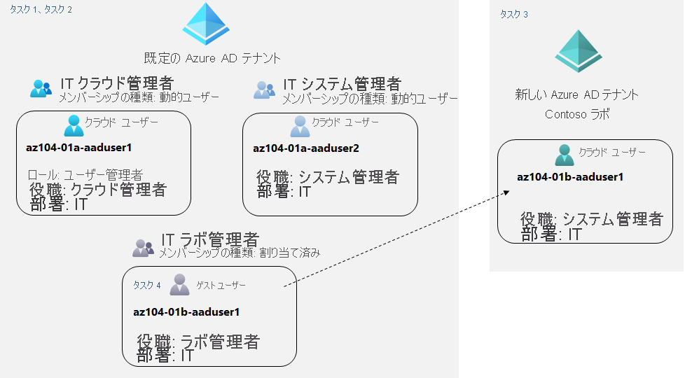

---
lab:
  title: 01 - Azure Active Directory ID を管理する
  module: Module 01 - Identity
ms.openlocfilehash: de59a0e8c7634ee756fc66301b90f73233a9cf8a
ms.sourcegitcommit: d3c9789a6f4761a9c69901b8aefdabb39769235c
ms.translationtype: HT
ms.contentlocale: ja-JP
ms.lasthandoff: 05/10/2022
ms.locfileid: "144844254"
---
# ラボ 01 - Azure Active Directory ID を管理する

# 受講生用ラボ マニュアル

## ラボのシナリオ

Contoso のユーザーが Azure AD を使用して認証できるようにするには、ユーザーおよびグループ アカウントのプロビジョニングを行う必要があります。 グループのメンバーシップは、ユーザーの役職に基づいて自動的に更新されます。 テスト ユーザー アカウントを使用してテスト Azure AD テナントを作成し、Contoso Azure サブスクリプションのリソースに対する制限付きアクセス許可をそのアカウントに付与する必要もあります。

## 目標

このラボでは、次のことを行います。

+ タスク 1:Azure AD ユーザーを作成および構成する
+ タスク 2:割り当て済みで動的なメンバーシップを持つ Azure AD グループを作成する
+ タスク 3:Azure Active Directory (AD) テナントを作成する
+ タスク 4:Azure AD のゲスト ユーザーを管理する 

## 推定時間:30 分

## アーキテクチャの図

## Instructions

### 演習 1

#### タスク 1:Azure AD ユーザーを作成および構成する

このタスクでは、Azure AD ユーザーを作成および構成します。

>**注**:以前にこの Azure AD テナントで Azure AD Premium の試用版ライセンスを使用したことがある場合は、新しい Azure AD テナントが必要になり、その新しい Azure AD テナントで、タスク 3 の後にタスク 2 を実行します。

1. [Azure portal](https://portal.azure.com) にサインインします。

1. Azure portal で、 **[Azure Active Directory]** を検索して選択します。

1. [Azure Active Directory] ブレードで、**[管理]** セクションまでスクロールダウンし、**[ユーザー設定]** をクリックして、使用可能な構成オプションを確認します。

1. [Azure Active Directory] ブレードの **[管理]** セクションで **[ユーザー]** をクリックし、ユーザー アカウントをクリックして **[プロファイル]** の設定を表示します。 

1. **[編集]** をクリックし、**[設定]** セクションで **[利用場所]** を **[米国]** に設定し、**[保存]** をクリックして、変更を適用します。

    >**注**:これは、このラボの後半で Azure AD Premium P2 ライセンスをユーザー アカウントに割り当てるために必要です。

1. **[ユーザー - すべてのユーザー]** ブレードに戻り、**[+ 新しいユーザー]** を選択します。

1. 次の設定で、新しいユーザーを作成します (他の設定は既定値のままにします)。

    | 設定 | 値 |
    | --- | --- |
    | ユーザー名 | **az104-01a-aaduser1** |
    | 名前 | **az104-01a-aaduser1** |
    | 自分でパスワードを作成する | enabled |
    | 初期パスワード | **セキュリティで保護されたパスワードを指定する** |
    | 利用場所 | **米国** |
    | 役職 | **クラウド管理者** |
    | Department | **IT** |

    >**注**:**クリップボードに** 完全な **ユーザー プリンシパル名** (ユーザー名とドメイン) をコピーします。 このタスクの後半で必要になります。

1. ユーザーのリストで、新しく作成したユーザー アカウントをクリックして、そのブレードを表示します。

1. **[管理]** セクションで使用できるオプションを確認し、ユーザー アカウントに割り当てられた Azure AD のロールと、Azure リソースに対するユーザー アカウントのアクセス許可を識別できることに注意してください。

1. **[管理]** セクションで、**[割り当てられたロール]** をクリックし、**[+ 割り当ての追加]** ボタンをクリックして、**ユーザー管理者** ロールを **az104-01a-aaduser1** に割り当てます。

    >**注**:新しいユーザーをプロビジョニングするときに、Azure AD の役割を割り当てるオプションもあります。

1. **InPrivate** ブラウザー ウィンドウを開き、新しく作成したユーザー アカウントを使用して [Azure portal](https://portal.azure.com) にログインします。 パスワードの更新を求めるダイアログが表示されたら、パスワードをご自分で選択したセキュリティで保護されたパスワードに変更します。 

    >**注**:ユーザー名 (ドメイン名を含む) を入力するのではなく、クリップボードの内容を貼り付けることができます。

1. Azure portal の **InPrivate** ブラウザー ウィンドウで、"**Azure Active Directory**" を検索して選択します。

    >**注**:このユーザー アカウントは Azure Active Directory テナントにアクセスできますが、Azure リソースにアクセスできません。 これは予想されたことであり、このようなアクセスは Azure の役割ベースのアクセス制御を使用して明示的に付与する必要があるためです。 

1. **InPrivate** ブラウザー ウィンドウの Azure AD ブレードで、**[管理]** セクションまでスクロールダウンし、**[ユーザー設定]** をクリックします。また、構成オプションを変更するアクセス許可がないことに注意してください。

1. **InPrivate** ブラウザー ウィンドウの Azure AD ブレードの **[管理]** セクションで、**[ユーザー]** をクリックし、**[+ 新しいユーザー]** をクリックします。

1. 次の設定で、新しいユーザーを作成します (他の設定は既定値のままにします)。

    | 設定 | 値 |
    | --- | --- |
    | ユーザー名 | **az104-01a-aaduser2** |
    | 名前 | **az104-01a-aaduser2** |
    | 自分でパスワードを作成する | enabled |
    | 初期パスワード | **セキュリティで保護されたパスワードを指定する** |
    | 利用場所 | **米国** |
    | 役職 | **システム管理者** |
    | Department | **IT** |

1. Azure portal から az104-01a-aaduser1 ユーザーとしてサインアウトし、InPrivate ブラウザー ウィンドウを閉じます。

#### タスク 2:割り当て済みで動的なメンバーシップを持つ Azure AD グループを作成する

このタスクでは、割り当てられた動的メンバーシップを持つ Azure Active Directory グループを作成します。

1. **ユーザー アカウント** でサインインしている Azure portal に戻り、Azure AD テナントの **[概要]** ブレードに戻り、**[管理]** セクションの **[ライセンス]** をクリックします。

    >**注**:動的グループを実装するには、Azure AD Premium P1 または P2 ライセンスが必要です。

1. **[管理]** セクションで、**[すべての製品]** をクリックします。

1. **[+ 試用または購入]** をクリックし、Azure AD Premium P2 の無料試用版をアクティブにします。

1. ブラウザー ウィンドウを更新して、アクティブ化が成功したことを確認します。 

 >**注**:ライセンスがアクティブになるまで、最大で 10 分かかることがあります。 表示されるまでページの更新を続けてください。 ライセンスがアクティブになるまで、先に進まないでください。

1. **[ライセンス - すべての製品]** ブレードで、**[Azure Active Directory Premium P2]** エントリを選択し、Azure AD Premium P2 のすべてのライセンス オプションをユーザー アカウントと新しく作成した 2 つのユーザー アカウントに割り当てます。

1. Azure portal で、Azure AD テナント ブレードに戻り、**[グループ]** をクリックします。

1. **[+ 新しいグループ]** ボタンを使用して、次の設定で新しいグループを作成します。

    | 設定 | 値 |
    | --- | --- |
    | グループの種類 | **Security** |
    | グループ名 | **IT クラウド管理者** |
    | グループの説明 | **Contoso IT クラウド管理者** |
    | メンバーシップの種類 | **動的ユーザー** |

    >**注**: **[メンバーシップの種類]** ドロップダウン リストがグレー表示されている場合は、数分待ってからブラウザーのページを更新します。

1. **[動的クエリの追加]** をクリックします。

1. **[動的メンバーシップ ルール]** ブレードの **[ルールの構成]** タブで、次の設定を使用して新しいルールを作成します。

    | 設定 | 値 |
    | --- | --- |
    | プロパティ | **jobTitle** |
    | 演算子 | **[等しい]** |
    | 値 | **クラウド管理者** |

1. **[+式の追加]** をクリックしてルールを保存し、 **[保存]** をクリックします。 **[新しいグループ]** ブレードに戻り、**[作成]** をクリックします。 

1. Azure AD テナントの **[グループ - すべてのグループ]** ブレードに戻り、**[+ 新しいグループ]** ボタンをクリックし、次の設定で新しいグループを作成します。

    | 設定 | 値 |
    | --- | --- |
    | グループの種類 | **Security** |
    | グループ名 | **IT システム管理者** |
    | グループの説明 | **Contoso IT システム管理者** |
    | メンバーシップの種類 | **動的ユーザー** |

1. **[動的クエリの追加]** をクリックします。

1. **[動的メンバーシップ ルール]** ブレードの **[ルールの構成]** タブで、次の設定を使用して新しいルールを作成します。

    | 設定 | 値 |
    | --- | --- |
    | プロパティ | **jobTitle** |
    | 演算子 | **[等しい]** |
    | 値 | **システム管理者** |

1. **[+式の追加]** をクリックしてルールを保存し、 **[保存]** をクリックします。 **[新しいグループ]** ブレードに戻り、**[作成]** をクリックします。 

1. Azure AD テナントの **[グループ - すべてのグループ]** ブレードに戻り、**[+ 新しいグループ]** ボタンをクリックし、次の設定で新しいグループを作成します。

    | 設定 | 値 |
    | --- | --- |
    | グループの種類 | **Security** |
    | グループ名 | **IT ラボ管理者** |
    | グループの説明 | **Contoso IT ラボ管理者** |
    | メンバーシップの種類 | **割り当て済み** |
    
1. **[メンバーが選択されていません]** をクリックします。

1. **[メンバーの追加]** ブレードで、**[IT クラウド管理者]** グループと **[IT システム管理者]** グループを見つけて選択し、**[新しいグループ]** ブレードに戻って **[作成]** をクリックします。

1. **[グループ - すべてのグループ]** ブレードに戻り、**IT クラウド管理者** グループを表すエントリをクリックし、**[メンバー]** ブレードを表示します。 グループ メンバーのリストに **az104-01a-aaduser1** が表示されることを確認します。

    >**注**:動的メンバーシップ グループの更新に遅延が発生する可能性があります。 更新を迅速化するには、グループ ブレードに移動し、**[動的メンバーシップ ルール]** ブレードを表示し、**[ルール構文]** テキスト ボックスに一覧表示されているルールを **編集** して末尾に空白を追加し、変更を **保存** します。

1. **[グループ - すべてのグループ]** ブレードに戻り、**IT システム管理者** グループを表すエントリをクリックし、**[メンバー]** ブレードを表示します。 グループ メンバーのリストに **az104-01a-aaduser2** と表示されていることを確認します。

#### タスク 3:Azure Active Directory (AD) テナントを作成する

このタスクでは、新しい Azure AD テナントを作成します。

1. Azure portal で、 **[Azure Active Directory]** を検索して選択します。

1. **[テナントの管理]** をクリックし、次の画面で **[作成]** をクリックして、次の設定を指定します。

    | 設定 | 値 |
    | --- | --- |
    | ディレクトリ タイプ | **Azure Active Directory** |
    
1. ページの下部の **次へ: 構成**

    | 設定 | 値 |
    | --- | --- |
    | 組織名 | **Contoso Lab** |
    | 初期ドメイン名 | 小文字と数字で構成され、文字で始まる有効な DNS 名 | 
    | 国/リージョン | **米国** |

   > **注**: **[初期ドメイン名]** は、自分の組織や別の組織と一致する可能性のある正当な名前であってはなりません。 **[初期ドメイン名]** テキスト ボックスの緑色のチェック マークは、入力したドメイン名が有効で一意であることを示します。

1. **[Review + create]\(レビュー + 作成\)** をクリックし、 **[作成]** をクリックします。

1. Azure portal のツールバーにある **[ここをクリックして新しいテナントに移動する:Contoso Lab]** リンク、または **[ディレクトリとサブスクリプション]** ボタン ([Cloud Shell] ボタンの右側) を使用して、新しく作成した Azure AD テナントのブレードを表示します。

#### タスク 4:Azure AD ゲスト ユーザーを管理する

このタスクでは、Azure AD ゲスト ユーザーを作成し、Azure サブスクリプション内のリソースへのアクセスを許可します。

1. Contoso Lab Azure AD テナントを表示する Azure portal の **[管理]** セクションで、**[ユーザー]** をクリックし、**[+ 新しいユーザー]** をクリックします。

1. 次の設定で、新しいユーザーを作成します (他の設定は既定値のままにします)。

    | 設定 | 値 |
    | --- | --- |
    | ユーザー名 | **az104-01b-aaduser1** |
    | 名前 | **az104-01b-aaduser1** |
    | 自分でパスワードを作成する | enabled |
    | 初期パスワード | **セキュリティで保護されたパスワードを指定する** |
    | 役職 | **システム管理者** |
    | Department | **IT** |

1. 新しく作成されたプロファイルをクリックします。

    >**注**:**クリップボードに** 完全な **ユーザー プリンシパル名** (ユーザー名とドメイン) をコピーします。 このタスクの後半で必要になります。

1. Azure portal のツール バーにある **[ディレクトリとサブスクリプション]** ボタン ([Cloud Shell] ボタンの右側) を使用して、既定の Azure AD テナントに切り替えます。

1. **[ユーザー - すべてのユーザー]** ブレードに戻り、**[+ 新しいゲスト ユーザー]** をクリックします。

1. 次の設定で新しいゲスト ユーザーを招待します (他の設定は既定値のままにします)。

    | 設定 | [値] |
    | --- | --- |
    | 名前 | **az104-01b-aaduser1** |
    | 電子メール アドレス | このタスクで前にコピーしたユーザー プリンシパル名 |
    | 利用場所 | **米国** |
    | 役職 | **ラボ管理者** |
    | Department | **IT** |

1. **[招待]** をクリックします。 

1. **[ユーザー - すべてのユーザー]** ブレードに戻り、新しく作成されたゲスト ユーザー アカウントを表すエントリをクリックします。

1. **[az104-01b-aaduser1 - プロファイル]** ブレードで、**[グループ]** をクリックします。

1. **[+ メンバーシップを追加します]** をクリックし、ゲスト ユーザー アカウントを **IT ラボ管理者** グループに追加します。

#### タスク 5: リソースをクリーンアップする

> **注**:新規に作成し、使用しなくなったすべての Azure リソースを削除することを忘れないでください。 使用していないリソースを削除することで、予期しないコストが発生しなくなります。 この場合、Azure Active Directory テナントとそのオブジェクトに関連する追加料金は発生しませんが、このラボで作成したユーザー アカウント、グループ アカウント、および Azure Active Directory テナントの削除を検討する必要があります。

 > **注**:ラボのリソースをすぐに削除できなくても心配する必要はありません。 リソースに依存関係が存在し、削除に時間がかかる場合があります。 リソースの使用状況を監視することは管理者の一般的なタスクであるため、ポータルでリソースを定期的にチェックして、クリーンアップの進捗を確認するようにしてください。 

1. **Azure portal** で、検索バーで **Azure Active Directory** を検索します。 **Azure Active Directory** 内の **[管理]** で、**[ライセンス]** を選択します。 **[管理]** の下の **[ライセンス]** で、**[すべての製品]** を選択し、リストから **[Azure Active Directory Premium P2]** アイテムを選択します。 次に、**[ライセンス ユーザー]** を選択して続行します。 このラボでライセンスを割り当てたユーザー アカウント **az104-01a-aaduser1** および **az104-01a-aaduser2** を選択し、 **[イセンスの削除]** をクリックして、ダイアログが表示されたら **[はい]** をクリックします。

1. Azure portal で、**[ユーザー - すべてのユーザー]** ブレードに移動し、**az104-01b-aaduser1** ゲスト ユーザー アカウントを表すエントリをクリックします。**[az104-01b-aaduser1 - プロファイル]** ブレードで **[削除]** をクリックし、確認を求められたら、**[OK]** をクリックします。

1. 同じ手順を繰り返して、このラボで作成した残りのユーザー アカウントを削除します。

1. **[グループ - すべてのグループ]** ブレードに移動し、このラボで作成したグループを選択し、**[削除]** をクリックします。確認を求められたら、**[OK]** をクリックします。

1. Azure portal でツール バーの **[ディレクトリとサブスクリプション]** ボタン ([Cloud Shell] ボタンの右側) を使用して、Contoso Lab Azure AD テナントのブレードを表示します。

1. **[ユーザー - すべてのユーザー]** ブレードに移動し、**az104-01b-aaduser1** ユーザー アカウントを表すエントリをクリックします。**[az104-01b-aaduser1 - プロファイル]** ブレードで **[削除]** をクリックし、確認を求められたら、**[OK]** をクリックします。

1. Contoso Lab Azure AD テナントの **[Contoso Lab - 概要]** ブレードに移動し、 **[テナントの管理]** をクリックし、次の画面で **[Contoso Lab]** の横にあるボックスを選択し、 **[削除]** をクリックして、 **[テナント 'Contoso Lab' を削除しますか?]** ブレードで、 **[Azure リソースを削除する権限を取得する]** リンクを選択し、Azure Active Directory の **[プロパティ]** ブレードで、 **[Azure リソースのアクセス管理]** を **[はい]** に設定し、 **[保存]** を選択します。

1. **[テナント 'Contoso Lab' の削除]** ブレードに戻り、 **[更新]** をクリックして、 **[削除]** をクリックします。

> **注**:テナントに試用版ライセンスがある場合、テナントを削除する前に、試用版ライセンスの有効期限が切れるまで待つ必要があります。 これには追加費用はかかりません。

#### 確認

このラボでは、次のことを行いました。

- Azure AD ユーザーを作成および設定しました
- 割り当て済みおよび動的メンバーシップを持つ Azure AD グループを作成しました
- Azure Active Directory (AD) テナントを作成しました
- Azure AD ゲスト ユーザーを管理しました 
