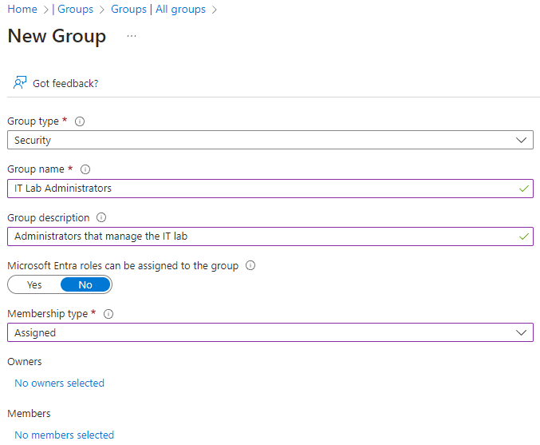

---
lab:
  title: 'ラボ 01: Microsoft Entra ID を管理する'
  module: Administer Identity
---

# ラボ 01 - Microsoft Entra ID を管理する

## ラボ概要

これは、Azure 管理者向けラボ シリーズの 1 つ目です。 このラボでは、ユーザーとグループについて説明します。 ユーザーとグループは、ID ソリューションの基本的な構成要素です。 

このラボでは Azure サブスクリプションが必要です。 お使いのサブスクリプションの種類により、このラボの機能が使用できるかどうかに影響する可能性があります。 リージョンを変更できますが、手順は**米国東部**を使って作成されています。 

## 推定時間:30 分

## ラボのシナリオ

あなたの組織は、アプリとサービスの運用前テスト用に新しいラボ環境を構築しています。  仮想マシンを含むラボ環境を管理するために、数名のエンジニアが雇用されています。 エンジニアが Microsoft Entra ID を使って認証できるようにするために、ユーザーとグループをプロビジョニングするという仕事があなたに課せられました。 管理のオーバーヘッドを最小限に抑えるには、役職に基づいてグループのメンバーシップを自動的に更新する必要があります。 

## 対話型のラボ シミュレーション

このラボでは、対話型のラボ シミュレーションを使います。 シミュレーションを使うと、同様のシナリオを自分のペースでクリックして進めることができます。 対話型シミュレーションとこのラボには違いがありますが、主要な概念の多くは同じです。 Azure サブスクリプションは必要ありません。

>**注:**  このシミュレーションは更新中です。 Microsoft Entra ID は、Azure Active Directory (Azure AD) の新しい名前です。 

+ [Entra ID の ID を管理します](https://mslabs.cloudguides.com/guides/AZ-104%20Exam%20Guide%20-%20Microsoft%20Azure%20Administrator%20Exercise%201)。 ユーザーを作成して構成し、グループに割り当てます。 Azure テナントを作成し、ゲスト アカウントを管理します。 

## アーキテクチャの図

## 職務スキル

+ タスク 1:ユーザー アカウントを作成して構成します。
+ タスク 2:グループを作成し、メンバーを追加します。

## タスク 1:ユーザー アカウントを作成して構成する

このタスクでは、ユーザー アカウントを作成して構成します。 ユーザー アカウントには、名前、部署、場所、連絡先情報などのユーザー データが格納されます。

1. **Azure portal** - `https://portal.azure.com` にサインインします。

    >**注:**  Azure portal はすべてのラボで使われます。 Azure を初めて使う場合は、`Quickstart Center` を検索して選びます。 少し時間を取り、**Azure portal の概要**に関する動画をご覧ください。 以前にポータルを使ったことがある場合でも、インターフェイスの操作とカスタマイズに関するいくつかのヒントとテクニックが参考になります。
    
1. `Microsoft Entra ID` を検索して選択します。 Microsoft Entra ID は、Azure のクラウドベースの ID およびアクセス管理ソリューションです。 少し時間を取り、左ペインに表示されているいくつかの機能を確認してください。 

1. **[概要]** ブレードを選び、次に **[テナントの管理]** タブを選びます。 

    >**ご存知でしたか?** テナントとは、アカウントとグループを含む Microsoft Entra ID の特定のインスタンスです。 状況に応じて、さらにテナントを作成し、テナント間を**切り替える**ことができます。 

1. **[Entra ID]** ページに戻り、**[ライセンス]** を選びます。 ここから、ライセンスの購入、所有しているライセンスの管理、ユーザーやグループへのライセンスの割り当てを行うことができます。 **[ライセンスされた機能]** を選び、使用できる機能を確認します。
   
### 新しいユーザーを作成する

1. **[ユーザー]** を選び、**[新しいユーザー]** ドロップダウンで **[新しいユーザーの作成]** を選びます。 

1. 次の設定で、新しいユーザーを作成します (他の設定は既定値のままにします)。 **[プロパティ]** タブには、ユーザー アカウントに含めることができるさまざまな情報がすべて表示されます。 

    | 設定 | 値 |
    | --- | --- |
    | ユーザー プリンシパル名 | `az104-user1` |
    | [表示名] | `az104-user1` |
    | パスワードの自動生成 | **checked** |
    | Account enabled | **checked** |
    | 役職 ([プロパティ] タブ) | `IT Lab Administrator` |
    | 部署 ([プロパティ] タブ) | `IT` |
    | 使用する場所 ([プロパティ] タブ) | **米国** |

1. 確認が完了したら、**[確認および作成]**、**[作成]** の順に選びます。

1. ページを更新して、新しいユーザーが作成されたことを確認します。 

### 外部ユーザーを招待する

1. **[新しいユーザー]** ドロップダウンで **[外部ユーザーの招待]** を選びます。 

    | 設定 | 値 |
    | --- | --- |
    | メール | 自分のメール アドレス |
    | [表示名] | your name |
    | 招待メッセージを送信する | **チェックボックスをオンにします** |
    | メッセージ | `Welcome to Azure and our group project` |

1. **[プロパティ]** タブに移動します。これらのフィールドを含む基本情報を入力します。 

    | 設定 | Value |
    | --- | --- |
    | Job title  | `IT Lab Administrator` |
    | 部署  | `IT` |
    | 使用する場所 ([プロパティ] タブ) | **米国** |

1. **[確認と招待]**、**[招待]** の順に選びます。

1. ページを **[更新]** し、招待したユーザーが作成されたことを確認します。 招待メールはすぐに届くはずです。 

    >**注:**  ユーザー アカウントを個別に作成することはほとんどありません。 組織がどのようにユーザー アカウントを作成して管理する計画か知っていますか?
    
## タスク 2:グループを作成し、メンバーを追加する

このタスクでは、グループ アカウントを作成します。 グループ アカウントにはユーザー アカウントまたはデバイスを含めることができます。 メンバーをグループに割り当てるには、2 つの基本的な方法があります。静的と動的です。 静的グループの場合、管理者がメンバーを手動で追加および削除する必要があります。  動的グループは、ユーザー アカウントまたはデバイスのプロパティに基づいて自動的に更新されます。 たとえば、役職です。 

1. Azure portal で、`Groups` を検索して選択します。

1. 少し時間を取り、左ペインにあるグループ設定を確認してください。

   + **[有効期限]** を使うと、グループの有効期間を日単位で構成できます。 その後は、所有者がグループを更新する必要があります。
   + **[名前付けポリシー]** を使うと、ブロックする単語を構成し、グループ名にプレフィックスまたはサフィックスを追加することができます。

1. **[すべてのグループ]** ブレードで、**[+ 新しいグループ]** を選び、新しいグループを作成します。     

    | 設定 | 値 |
    | --- | --- |
    | グループの種類 | **Security** |
    | グループ名 | `IT Lab Administrators` |
    | グループの説明 | `Administrators that manage the IT lab` |
    | メンバーシップの種類 | **割り当て済み** |

    >**注**:動的メンバーシップには、Entra ID Premium P1 または P2 ライセンスが必要です。 他の **[メンバーシップの種類]** を使用できる場合は、ドロップダウンにオプションが表示されます。 
    
    

1. **[所有者が選択されていません]** を選びます。

1. **[所有者の追加]** ページで、自分自身 (右上隅に表示) を検索し、所有者として**選びます**。 複数の所有者を持つことができることに注目してください。 

1. **[メンバーが選択されていません]** を選択します。

1. **[メンバーの追加]** ペインで、招待した **az104-user1** と**ゲスト ユーザー**を検索して**選びます**。 両方のユーザーをグループに追加します。 

1. **[作成]** を選んでグループをデプロイします。

1. ページを **[更新]** し、グループが作成されたことを確認します。

1. 新しいグループを選び、**[メンバー]** と **[所有者]** の情報を確認します。

>**注:**  多数のグループを管理することができます。 組織には、グループを作成してメンバーを追加する計画がありますか?
   
## リソースのクリーンアップ

**自分のサブスクリプション**で作業している場合は、お手数ですが、ラボ リソースを削除してください。 これにより、リソースが確実に解放されるため、コストが最小限に抑えられます。 ラボ リソースを削除する最も簡単な方法は、ラボ リソース グループを削除することです。 これにより、作成した Entra ID ユーザーまたはグループは削除されないことに注意してください。 

+ Azure portal で、リソース グループを選び、**[リソース グループの削除]**、**[リソース グループ名を入力してください]** の順に選び、**[削除]** をクリックします。
+ Azure PowerShell を使用する場合は、「`Remove-AzResourceGroup -Name resourceGroupName`」と入力します。
+ CLI を使用する場合は、「`az group delete --name resourceGroupName`」と入力します。
  

## Copilot を使用して学習を拡張する

Copilot は、Azure スクリプト ツールの使用方法を学習するのに役立ちます。 Copilot は、ラボでは対象外の、またはさらに詳しい情報が必要な領域でも役立ちます。 Edge ブラウザーを開き、Copilot (右上) を選択するか、*copilot.microsoft.com* に移動します。 これらのプロンプトを試すには数分かかります。
+ IT 管理者というセキュリティ グループを作成するための Azure PowerShell および CLI コマンドは何ですか? 公式のコマンド リファレンス ページを提供します。  
+ Microsoft Entra ID でユーザーとグループを管理するための詳細な戦略を提供します。
+ Azure portal でユーザーとグループを一括作成する手順は何ですか?
+ 内部および外部の Microsoft Entra ID ユーザー アカウントの比較表を提供します。 

## 自習トレーニングでさらに学習する

+ 「[Microsoft Entra ID の概要](https://learn.microsoft.com/training/modules/understand-azure-active-directory/)」。 Microsoft Entra ID を Active Directory DS と比較し、Microsoft Entra ID P1 および P2 について学習し、クラウドでドメインに参加しているデバイスとアプリを管理するために Microsoft Entra Domain Services の詳細を確認します。
+ 「[Microsoft Entra ID で Azure のユーザーとグループを作成する](https://learn.microsoft.com//training/modules/create-users-and-groups-in-azure-active-directory/)」。 Microsoft Entra ID でユーザーを作成します。 さまざまな種類のグループについて理解します。 グループを作成してメンバーを追加します。 企業間のゲスト アカウントを管理します。
+ [ユーザーが Microsoft Entra のセルフサービス パスワード リセットを使用してパスワードをリセットできるようにする](https://learn.microsoft.com/training/modules/allow-users-reset-their-password/)。 セルフサービス パスワード リセット を評価し、組織内のユーザーが自分のパスワードをリセットしたり、アカウントのロックを解除したりできるようにします。 セルフサービス パスワード リセット を設定、構成、テストします。

## 要点

以上でラボは完了です。 このラボの要点は次のとおりです。

+ テナントは組織を表し、社内外のユーザー向けに特定インスタンスの Microsoft クラウド サービスを管理するために役立ちます。
+ Microsoft Entra ID には、ユーザー アカウントとゲスト アカウントがあります。 各アカウントには、実行される予定の作業範囲に固有のアクセス レベルがあります。
+ グループは、関連するユーザーまたはデバイスをまとめるものです。 グループには、セキュリティと Microsoft 365 を含む 2 つの種類があります。
+ グループのメンバーシップは、静的または動的に割り当てることができます。
