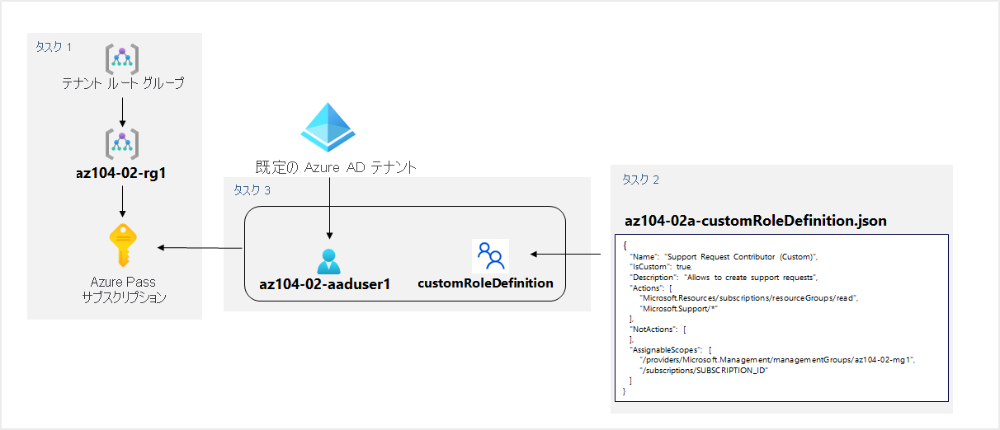

---
lab:
  title: 02a - サブスクリプションと RBAC を管理する
  module: Module 02 - Governance and Compliance
ms.openlocfilehash: 8318d90573a04b60e4b1cfd79ed2daa621e8401f
ms.sourcegitcommit: 8282cbcee5f7cd46bdc73d781c460d6a078049bb
ms.translationtype: HT
ms.contentlocale: ja-JP
ms.lasthandoff: 04/19/2022
ms.locfileid: "143611547"
---
# <a name="lab-02a---manage-subscriptions-and-rbac"></a>ラボ 02a - サブスクリプションと RBAC を管理する
# <a name="student-lab-manual"></a>受講生用ラボ マニュアル

## <a name="lab-requirements"></a>ラボの要件

このラボでは、Azure Active Directory (Azure AD) ユーザーを作成し、カスタムの Azure ロール ベースのアクセス制御 (RBAC) ロールを作成し、これらのロールを Azure AD ユーザーに割り当てるためのアクセス許可が必要です。 すべてのラボ ホスティング業者がこの機能を提供できるわけではありません。 このラボの可用性については、インストラクターに問い合わせてください。

## <a name="lab-scenario"></a>ラボのシナリオ

Contoso の Azure リソースの管理を強化するために、次の機能を実装する任務を負いました。

- Contoso のすべての Azure サブスクリプションを含む管理グループを作成する

- 管理グループ内のすべてのサブスクリプションに対するサポート要求を、指定された Azure Active Directory ユーザーに提出するアクセス許可を付与する。 そのユーザーのアクセス許可は、次の場合に限定する必要があります。 

    - サポート要求チケットの作成
    - リソース グループの表示 

## <a name="objectives"></a>目標

このラボでは、次のことを行います。

+ タスク 1:管理グループを実装する
+ タスク 2:カスタム RBAC ロールを作成する 
+ タスク 3:RBAC ロールを割り当てる


## <a name="estimated-timing-30-minutes"></a>推定時間:30 分

## <a name="architecture-diagram"></a>アーキテクチャの図




## <a name="instructions"></a>Instructions

### <a name="exercise-1"></a>演習 1

#### <a name="task-1-implement-management-groups"></a>タスク 1:管理グループを実装する

このタスクでは、管理グループを作成および構成します。 

1. [**Azure Portal**](http://portal.azure.com) にサインインします。

1. **「管理グループ」** を検索して、選択し、 **「管理グループ」** ブレードに移動します。

1. **「管理グループ」** ブレード上部のメッセージを確認します。 **「Directory 管理者として登録されていますが、ルート管理グループへのアクセスに必要な権限がありません」** というメッセージが表示された場合、以下の処理を行ってください。

    1. Azure portal で、 **[Azure Active Directory]** を検索して選択します。
    
    1.  Azure Active Directory テナントのプロパティを表示しているブレードの、左側の垂直方向に配置されたメニュー内で **「管理」** セクションから **「プロパティ」** を選択します。
    
    1.  Azure Active Directory テナントの **「プロパティ」** ブレードの、 **「Azure リソースのアクセス管理」** セクションで **「はい」** を選択し、さらに **「保存」** を選択します。
    
    1.  **「管理グループ」** ブレードに戻り、 **「更新」** をクリックします。

1. **「管理グループ」** ブレードで、 **「+ 作成」** をクリックします。

    >**注**:以前に管理グループを作成していない場合は、 **「管理グループの使用を開始」** を選択します。

1. 次の設定で管理グループを作成します。

    | 設定 | [値] |
    | --- | --- |
    | 管理グループ ID | **az104-02-mg1** |
    | 管理グループの表示名 | **az104-02-mg1** |

1. 管理グループのリストで、新しく作成された管理グループを表すエントリをクリックしします。

1. **「az104-02-mg1」** ブレードで、 **「サブスクリプション」** をクリックします。 

1. **[az104-02-mg1 \| サブスクリプション]** ブレードで、 **[+ 追加]** をクリックし、 **[サブスクリプションの追加]** ブレードの **[サブスクリプション]** ドロップダウンリストから、このラボで使用するサブスクリプションを選択して、 **[保存]** をクリックします。

    >**注**: **[az104-02-mg1 \| サブスクリプション]** ブレードで、Azure サブスクリプションの ID をクリップボードにコピーします。 これは、次のタスクで必要になります。

#### <a name="task-2-create-custom-rbac-roles"></a>タスク 2:カスタム RBAC ロールを作成する

このタスクでは、カスタム RBAC ロールの定義を作成します。

1. ラボのコンピューターから **\\Allfiles\\Labs\\02\\az104-02a-customRoleDefinition.json** ファイルをメモ帳で開き、その内容を確認します。

   ```json
   {
      "Name": "Support Request Contributor (Custom)",
      "IsCustom": true,
      "Description": "Allows to create support requests",
      "Actions": [
          "Microsoft.Resources/subscriptions/resourceGroups/read",
          "Microsoft.Support/*"
      ],
      "NotActions": [
      ],
      "AssignableScopes": [
          "/providers/Microsoft.Management/managementGroups/az104-02-mg1",
          "/subscriptions/SUBSCRIPTION_ID"
      ]
   }
   ```
    > **注**:ファイルがラボ環境内のローカルのどこに格納されているかが分からない場合は、インストラクターに確認してください。

1. JSON ファイルの `SUBSCRIPTION_ID` プレースホルダーを、クリップボードにコピーしたサブスクリプション ID に置き換えて、変更を保存します。

1. Azure portal で、 **「Cloud Shell」** ウィンドウを開くには、検索テキストボックスの右側にあるツールバー アイコンを直接クリックします。

1. **Bash** または **PowerShell** の選択を求めるメッセージが表示されたら、 **[PowerShell]** を選択します。 

    >**注**:**Cloud Shell** の初回起動時に **「ストレージがマウントされていません」** というメッセージが表示された場合は、このラボで使用しているサブスクリプションを選択し、 **「ストレージの作成」** を選択します。 

1. [Cloud Shell] ペインのツールバーで、 **[ファイルのアップロード/ダウンロード]** アイコンをクリックし、ドロップダウン メニューの **[アップロード]** をクリックして、ファイル **\\Allfiles\\Labs\\02\\az104-02a-customRoleDefinition.json** を Cloud Shell のホーム ディレクトリにアップロードします。

1. Cloud Shell ウィンドウから、次の操作を実行して、カスタム ロール定義を作成します。

   ```powershell
   New-AzRoleDefinition -InputFile $HOME/az104-02a-customRoleDefinition.json
   ```

1. [Cloud Shell] ペインを閉じます。

#### <a name="task-3-assign-rbac-roles"></a>タスク 3:RBAC ロールを割り当てる

このタスクでは、Azure Active Directory ユーザーを作成し、前のタスクで作成した RBAC ロールをそのユーザーに割り当て、ユーザーが RBAC ロール定義で指定されたタスクを実行できることを確認します。

1. Azure portal の「Azure Active Directory」ブレードで、 **「Azure Active Directory」** を検索して選択し、 **「ユーザー」** をクリックして、 **「+ 新しいユーザー」** をクリックします。

1. 次の設定で、新しいユーザーを作成します (他の設定は既定値のままにします)。

    | 設定 | 値 |
    | --- | --- |
    | ユーザー名 | **az104-02-aaduser1**|
    | 名前 | **az104-02-aaduser1**|
    | 自分でパスワードを作成する | enabled |
    | 初期パスワード | **セキュリティで保護されたパスワードを指定する** |

    >**注**:**クリップボードに** 完全な **ユーザー名** をコピーします。 このラボで後ほど必要になります。

1. Azure portal で、**az104-02-mg1** 管理グループに戻り、その **詳細** を表示します。

1. **[アクセス制御 (IAM)]** をクリックし、 **[+ 追加]** 、 **[ロールの割り当て]** の順にクリックして、新しく作成したユーザー アカウントに **Support Request Contributor (Custom)** の役割を割り当てます。

1. **「InPrivate」** ブラウザー ウィンドウを開き、新しく作成したユーザー アカウントを使用して [Azure portal](https://portal.azure.com) にログインします。 パスワードの更新を求められたら、ユーザー用にパスワードを変更します。

    >**注**:ユーザー名を入力するのではなく、クリップボードの内容を貼り付けることができます。

1. Azure portal の **「InPrivate」** ブラウザー ウィンドウで、 **「リソース グループ」** を検索して選択し、az104-02-aaduser1 ユーザーがすべてのリソース グループを表示できることを確認します。

1. Azure portal の **「InPrivate」** ブラウザー ウィンドウで、 **「すべてのリソース」** を検索して選択し、az104-02-aaduser1 ユーザーがリソースを表示できないことを確認します。

1. Azure portal の **「InPrivate」** ブラウザー ウィンドウで、 **「ヘルプとサポート」** を検索して選択し、 **「+ サポート要求の作成」** をクリックします。 

1. 「**InPrivate**」ブラウザー ウィンドウの「**ヘルプ + サポート - 新しいサポート リクエスト**」ブレードの「**問題の説明/概要**」タブで、「概要」フィールドに「**サービスとサブスクリプションの制限**」入力し、「**サービスとサブスクリプションの制限 (クォータ)** 」の問題の種類を選択します。 このラボで使用しているサブスクリプションは、「**サブスクリプション**」ドロップダウン リストに表示されていることに注意してください。

    >**注**:このラボで使用しているサブスクリプションが **「サブスクリプション」** ドロップダウン リストに表示されている場合、使用しているアカウントに、サブスクリプション固有のサポート要求を作成するために必要なアクセス許可があることを示しています。

    >**注**: **「サービスとサブスクリプションの制限 (クォータ)」** オプションが表示されない場合は、Azure portal からサインアウトしてログインし直します。

1. サポート要求の作成を続行しないでください。 代わりに、Azure portal から az104-02-aaduser1 ユーザーとしてサインアウトし、「InPrivate」ブラウザー ウィンドウを閉じてください。

#### <a name="task-4-clean-up-resources"></a>タスク 4: リソースをクリーンアップする

   >**注**:新規に作成し、使用しなくなったすべての Azure リソースを削除することを忘れないでください。 この課題で作成したリソースで余分なコストは発生しませんが、未使用のリソースを削除すると予期しない料金は発生しなくなります。

   >**注**:ラボのリソースをすぐに削除できなくても心配する必要はありません。 リソースに依存関係が存在し、削除に時間がかかる場合があります。 リソースの使用状況を監視することは管理者の一般的なタスクであるため、ポータルでリソースを定期的にチェックして、クリーンアップの進捗を確認するようにしてください。

1. Azure portal で **「Azure Active Directory」** を検索して選択し、「Azure Active Directory」ブレードで、 **「ユーザー」** をクリックします。

1. **「ユーザー - すべてのユーザー」** ブレードで **「az104-02-aaduser1」** をクリックします。

1. **「az104-02-aaduser1 - プロファイル」** ブレードで、 **「オブジェクト ID」** 属性の値をコピーします。

1. Azure portal 内の **「Cloud Shell」** で **PowerShell** セッションを開始します。

1. [Cloud Shell] ペインで、次の手順を実行してカスタム ロール定義の割り当てを削除します (`[object_ID]` プレースホルダーを、このタスクの前半でコピーした **az104-02-aaduser1** の Azure Active Directory ユーザー アカウントの **object ID** 属性の値で置き換えます)。

   ```powershell
   
   $scope = (Get-AzRoleDefinition -Name 'Support Request Contributor (Custom)').AssignableScopes[0]

   Remove-AzRoleAssignment -ObjectId '[object_ID]' -RoleDefinitionName 'Support Request Contributor (Custom)' -Scope $scope
   ```

1. 「Cloud Shell」ウィンドウから次の手順を実行して、カスタム ロールの定義を削除します。

   ```powershell
   Remove-AzRoleDefinition -Name 'Support Request Contributor (Custom)' -Force
   ```

1. Azure portal で、**Azure Active Directory** の **「ユーザー - すべてのユーザー」** ブレードに戻り、**az104-02-aaduser1** ユーザー アカウントを削除します。

1. Azure portal で、 **「管理グループ」** ブレードに戻ります。 

1. **「管理グループ」** ブレードで、**az104-02-mg1** 管理グループの下のサブスクリプションの横にある **省略記号** アイコンを選択し、 **「移動」** を選択してサブスクリプションを **テナント ルート管理グループ** に移動します。

   >**注**:このラボを実行する前にカスタム管理グループ階層を作成した場合を除き、ターゲットの管理グループが **テナント ルート管理グループ** であると考えられます。
   
1. **「更新」** を選択して、サブスクリプションが **テナント ルート管理グループ** に正常に移動したことを確認します。

1. **「管理グループ」** ブレードに戻り、**az104-02-mg1** 管理グループの右側にある **「省略記号」** アイコンを右クリックし、 **「削除」** をクリックします。

#### <a name="review"></a>確認

このラボでは、次のことを行いました。

- 管理グループを作成しました
- カスタム RBAC ロールを作成しました 
- RBAC ロールを割り当てました
