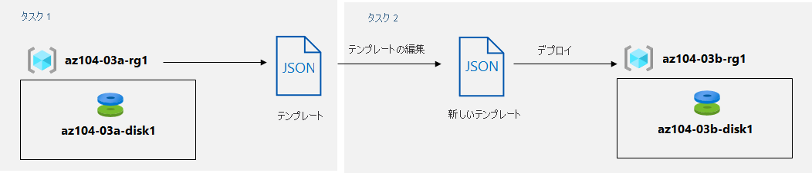

---
lab:
    title: '03b - ARM テンプレートを使用して Azure リソースを管理する'
    module: 'モジュール 03 - Azure 管理'
---

# ラボ 03b - ARM テンプレートを使用して Azure リソースを管理する
# 学生用ラボ マニュアル

## ラボ シナリオ
Azure portal を使用して、リソースのプロビジョニングとリソース グループに基づく構成に関連する基本的な Azure 管理機能を確認しました。次は、Azure Resource Manager テンプレートを使用して同等のタスクを実行します。

## 目標

このラボでは次の内容を学習します。

+ タスク 1: Azure マネージド ディスクのデプロイのために ARM テンプレートを確認する
+ タスク 2: ARM テンプレートを使用して、Azure マネージド ディスクを作成する
+ タスク 3: マネージド ディスクの ARM テンプレートベースのデプロイを確認する

## 予想時間: 20 分

## アーキテクチャの図



## 指示

### 演習 1

#### タスク 1: Azure マネージド ディスクのデプロイのために ARM テンプレートを確認する

このタスクでは、Azure Resource Manager テンプレートを使用して Azure ディスク リソースを作成します。

1. [**Azure portal**](https://portal.azure.com) にサインインします。

1. Azure portalで、**「リソース グループ」** を検索して選択します。 

1. リソース グループのリストで、**az104-03a-rg1** をクリックします。

1. **az104-03a-rg1** リソース グループ ブレードの **「設定」** セクションで、**「デプロイ」** をクリックします。

1. **az104-03a-rg1 - デプロイ** ブレードで、デプロイの一覧の最初のエントリをクリックします。

1. **Microsoft.ManagedDisk-*XXXXXXXXX* \| 概要** ブレードで、「**テンプレート**」 をクリックします。

    >**注**: テンプレートのコンテンツを確認し、ローカル コンピューターに**ダウンロード**して、**ライブラリに追加する**か、もう一度**デプロイ** するオプションがあることに注意してください。

1. **「ダウンロード」** をクリックし、テンプレートとパラメーター ファイルを含む圧縮ファイルをラボ コンピューターの **Downloads** フォルダーに保存します。

1. **Microsoft.ManagedDisk-*XXXXXXXXX* \| 「テンプレート」** ブレードで、**「入力」** をクリックします。

1. **場所**パラメーターの値をメモします。これは、次のタスクで必要になります。

1. ダウンロードしたファイルの内容をラボ コンピューターの **Downloads** フォルダーに抽出します。

    >**注**: これらのファイルは、**\\Allfiles\\Labs\\03\\az104-03b-md-template.json** および **\\Allfiles\\Labs\\03\\az104-03b-md-parameters.json** でも入手可能です。
    
1. すべての**ファイル エクスプローラー**ウィンドウを閉じます。

#### タスク 2: ARM テンプレートを使用して、Azure マネージド ディスクを作成する

1. Azure portal で、**「カスタム テンプレートのデプロイ」** を検索して選択します。

1. **Marketplace** グループの下にある **「テンプレート デプロイ (カスタム テンプレートを使用してデプロイ)」** をクリックします。

1. **「カスタム デプロイ」** ブレードで、**「エディターで独自のテンプレートを作成」** をクリックします。

1. 「**テンプレートの編集**」 ブレードで、「**ファイルの読み込み**」 をクリックし、前の手順でダウンロードした **template.json** ファイルをアップロードします。

1. エディター ウィンドウで、次の行を削除します。

   ```json
   "sourceResourceId": {
       "type": "String"
   },
   "sourceUri": {
       "type": "String"
   },
   "osType": {
       "type": "String"
   },
   ```

   ```json
   "hyperVGeneration": {
       "defaultValue": "V1",
       "type": "String"
   },      
   ```

   ```json
   "osType": "[parameters('osType')]",
   ```

    >**注**: これらのパラメーターは、現在のデプロイには適用されないので削除されます。特に、sourceResourceId、sourceUri、osType および hyperVGeneration パラメーターは、既存の VHD ファイルから Azure ディスクを作成するために適用できます。

1. 変更を**保存**します。

1. 「**カスタム デプロイ**」 ブレードに戻って、「**パラメーターの編集**」 をクリックします。 

1. 「**テンプレートの編集**」 ブレードで、「**ファイルの読み込み**」 をクリックし、前の手順でダウンロードした **parameters.json** ファイルをアップロードして、変更を**保存**します。

1. **「カスタム デプロイ」** ブレードに戻って、次の設定を指定します。

    | 設定 | 値 |
    | --- |--- |
    | サブスクリプション | *このラボのために使用する Azure サブスクリプションの名前* |
    | リソース グループ | **新しい**リソース グループ **az104-03b-rg1** の名前 |
    | リージョン | この課題で使用しているサブスクリプションで使用できる Azure リージョンの名前 |
    | ディスク名 | **az104-03b-disk1** |
    | 場所 | 前のタスクでメモした場所パラメーターの値 |
    | SKU | **Standard_LRS** |
    | ディスク サイズ GB | **32** |
    | オプションを作成する | **空** |
    | ディスク暗号化セットのタイプ | **EncryptionAtRestWithPlatformKey** |
    | ネットワーク アクセス ポリシー | **AllowAll** |

1. 「**Review + create**」を選択し、「**作成**」を選択します。

1. デプロイが正常に完了したことを確認します。

#### タスク 3: マネージド ディスクの ARM テンプレートベースのデプロイを確認する

1. Azure portalで、**「リソース グループ」** を検索して選択します。 

1. リソース グループのリストで、**az104-03b-rg1** をクリックします。

1. **az104-03b-rg1** リソース グループ ブレードの **「設定」** セクションで、**「デプロイ」** をクリックします。

1. **「az104-03b-rg1 - デプロイ」** ブレードから、デプロイのリストの最初のエントリをクリックし、**「入力」** ブレードと **「テンプレート」** ブレードの内容を確認します。

#### リソースをクリーン アップする

   >**注**: このラボでデプロイしたリソースは削除しないでください。このモジュールの次のラボで、それらを参照します。

#### レビュー

このラボでは次の内容を学習しました。

- Azure マネージド ディスクのデプロイに関する ARM テンプレートを確認しました
- ARM テンプレートを使用して Azure マネージド ディスクを作成しました
- マネージド ディスクの ARM テンプレートベースのデプロイを確認しました
