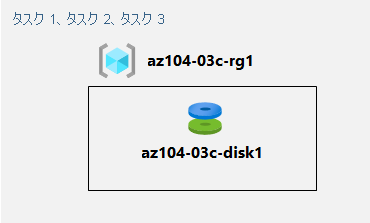

---
lab:
  title: 03c - Azure PowerShell を使用して Azure リソースを管理する
  module: Administer Azure Resources
---

# <a name="lab-03c---manage-azure-resources-by-using-azure-powershell"></a>ラボ 03c - Azure PowerShell を使用して Azure リソースを管理する
# <a name="student-lab-manual"></a>受講生用ラボ マニュアル

## <a name="lab-scenario"></a>ラボのシナリオ

既にリソースのプロビジョニング、リソース グループに基づく構成に関連する Azure の基本的な管理機能を、Azure portal と Azure Resource Manager テンプレートを使用して確認しました。次は Azure PowerShell を使って同等のタスクを実行します。 Azure PowerShell モジュールのインストールを避けるため、Azure Cloud Shell で使用できる PowerShell 環境を活用します。

                **メモ:** このラボをご自分のペースでクリックして進めることができる、 **[ラボの対話型シミュレーション](https://mslabs.cloudguides.com/guides/AZ-104%20Exam%20Guide%20-%20Microsoft%20Azure%20Administrator%20Exercise%206)** が用意されています。 対話型シミュレーションとホストされたラボの間に若干の違いがある場合がありますが、示されている主要な概念とアイデアは同じです。 

## <a name="objectives"></a>目標

このラボでは、次のことを行います。

+ タスク 1:Azure Cloud Shell で PowerShell セッションを開始する
+ タスク 2:Azure PowerShell を使用して、リソース グループと Azure マネージド ディスクを作成する
+ タスク 3:Azure PowerShell を使用してマネージド ディスクを構成する

## <a name="estimated-timing-20-minutes"></a>推定時間:20 分

## <a name="architecture-diagram"></a>アーキテクチャの図



## <a name="instructions"></a>Instructions

> **注**:作成する仮想マシンまたはユーザー アカウントに対して、必ず独自のセキュリティで保護されたパスワードを作成してください。 ユーザーの代わりに仮想マシンが作成された場合は、ポータルの **[パスワードのリセット]** を使用して、パスワードを更新してください。 

### <a name="exercise-1"></a>演習 1

#### <a name="task-1-start-a-powershell-session-in-azure-cloud-shell"></a>タスク 1:Azure Cloud Shell で PowerShell セッションを開始する

このタスクでは、Cloud Shell で PowerShell セッションを開きます。 

1. このポータルでは、Azure portal の右上にあるアイコンをクリックして **Azure Cloud Shell** を開きます。

1. **Bash** または **PowerShell** の選択を求めるメッセージが表示されたら、 **[PowerShell]** を選択します。 

    >**注**: **Cloud Shell** の初回起動時に "**ストレージがマウントされていません**" というメッセージが表示された場合は、このラボで使用しているサブスクリプションを選択し、**[ストレージの作成]** を選択します。 

1. メッセージが表示されたら、**[ストレージの作成]** をクリックし、[Azure Cloud Shell] ウィンドウが表示されるまで待ちます。 

1. [Cloud Shell] ウィンドウの左上隅にあるドロップダウン メニューに **PowerShell** が表示されていることを確認します。

#### <a name="task-2-create-a-resource-group-and-an-azure-managed-disk-by-using-azure-powershell"></a>タスク 2:Azure PowerShell を使用して、リソース グループと Azure マネージド ディスクを作成する

このタスクでは、Cloud Shell 内で Azure PowerShell セッションを使用して、リソース グループと Azure マネージド ディスクを作成します。

1. 前のラボで作成した **az104-03b-rg1** リソース グループと同じ Azure リージョンにリソース グループを作成するには、Cloud Shell 内の PowerShell セッションから次を実行します。

   ```powershell
   $location = (Get-AzResourceGroup -Name az104-03b-rg1).Location

   $rgName = 'az104-03c-rg1'

   New-AzResourceGroup -Name $rgName -Location $location
   ```
1. 新しく作成されたリソース グループのプロパティを取得するには、次のコマンドを実行します。

   ```powershell
   Get-AzResourceGroup -Name $rgName
   ```
1. このモジュールの前のラボで作成したものと同じ特性を持つ新しいマネージド ディスクを作成するには、次のコマンドを実行します。

   ```powershell
   $diskConfig = New-AzDiskConfig `
    -Location $location `
    -CreateOption Empty `
    -DiskSizeGB 32 `
    -Sku Standard_LRS

   $diskName = 'az104-03c-disk1'

   New-AzDisk `
    -ResourceGroupName $rgName `
    -DiskName $diskName `
    -Disk $diskConfig
   ```

1. 新しく作成されたディスクのプロパティを取得するには、次のコマンドを実行します。

   ```powershell
   Get-AzDisk -ResourceGroupName $rgName -Name $diskName
   ```

#### <a name="task-3-configure-the-managed-disk-by-using-azure-powershell"></a>タスク 3:Azure PowerShell を使用してマネージド ディスクを構成する

このタスクでは、Cloud Shell 内で Azure PowerShell セッションを使用して、Azure マネージド ディスクの構成を管理します。 

1. Azure マネージド ディスクのサイズを **64 GB** に増やすには、Cloud Shell 内の PowerShell セッションから次のコマンドを実行します。

   ```powershell
   New-AzDiskUpdateConfig -DiskSizeGB 64 | Update-AzDisk -ResourceGroupName $rgName -DiskName $diskName
   ```

1. 変更が有効になっていることを確認するには、次のコマンドを実行します。

   ```powershell
   Get-AzDisk -ResourceGroupName $rgName -Name $diskName
   ```

1. 現在の SKU が **Standard_LRS** であることを確認するには、次の手順を実行します。

   ```powershell
   (Get-AzDisk -ResourceGroupName $rgName -Name $diskName).Sku
   ```

1. ディスク パフォーマンス SKU を **Premium_LRS** に変更するには 、Cloud Shell 内の PowerShell セッションから次の手順を実行します。

   ```powershell
   New-AzDiskUpdateConfig -Sku Premium_LRS | Update-AzDisk -ResourceGroupName $rgName -DiskName $diskName
   ```

1. 変更が有効になっていることを確認するには、次のコマンドを実行します。

   ```powershell
   (Get-AzDisk -ResourceGroupName $rgName -Name $diskName).Sku
   ```

#### <a name="clean-up-resources"></a>リソースをクリーンアップする

   >**注**:このラボでデプロイしたリソースは削除しないでください。 このモジュールの次のラボで、それらを参照します。

#### <a name="review"></a>確認

このラボでは、次のことを行いました。

- Azure Cloud Shell での PowerShell セッションの開始
- Azure PowerShell を使用したリソース グループと Azure マネージド ディスクの作成
- Azure PowerShell を使用したマネージド ディスクの構成
