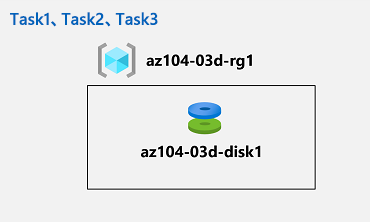

---
lab:
  title: 03d - Azure CLI を使用して Azure リソースを管理する
  module: Administer Azure Resources
---

# <a name="lab-03d---manage-azure-resources-by-using-azure-cli"></a>ラボ 03d - Azure CLI を使用して Azure リソースを管理する
# <a name="student-lab-manual"></a>受講生用ラボ マニュアル

## <a name="lab-scenario"></a>ラボのシナリオ

プロビジョニング リソースに関連する基本的な Azure 管理機能を確認し、Azure portal、Azure Resouce Manager テンプレート、および Azure PowerShell を使用して、リソース グループに基づいてリソースを整理しました。次は、Azure CLI を使用して同等のタスクを実行します。 Azure CLI のインストールを回避するには、Azure Cloud Shell で使用できる Bash 環境を活用します。

                **メモ:** このラボをご自分のペースでクリックして進めることができる、 **[ラボの対話型シミュレーション](https://mslabs.cloudguides.com/guides/AZ-104%20Exam%20Guide%20-%20Microsoft%20Azure%20Administrator%20Exercise%207)** が用意されています。 対話型シミュレーションとホストされたラボの間に若干の違いがある場合がありますが、示されている主要な概念とアイデアは同じです。 

## <a name="objectives"></a>目標

このラボでは、次のことを行います。

+ タスク 1:Azure Cloud Shell で Bash セッションを開始する
+ タスク 2:Azure CLI を使用して、リソース グループと Azure マネージド ディスクを作成する
+ タスク 3:Azure CLI を使用してマネージド ディスクを構成する

## <a name="estimated-timing-20-minutes"></a>推定時間:20 分

## <a name="architecture-diagram"></a>アーキテクチャの図



## <a name="instructions"></a>Instructions

### <a name="exercise-1"></a>演習 1

#### <a name="task-1-start-a-bash-session-in-azure-cloud-shell"></a>タスク 1:Azure Cloud Shell で Bash セッションを開始する

このタスクでは、Cloud Shell で Bash セッションを開きます。 

1. ポータルから、Azure portal の右上にあるアイコンをクリックして、**Azure Cloud Shell** を開きます。

1. **Bash** または **PowerShell** の選択を求めるメッセージが表示されたら、**[Bash]** を選択します。 

    >**注**: **Cloud Shell** の初回起動時に "**ストレージがマウントされていません**" というメッセージが表示された場合は、このラボで使用しているサブスクリプションを選択し、**[ストレージの作成]** を選択します。 

1. メッセージが表示されたら、**[ストレージの作成]** をクリックし、[Azure Cloud Shell] ウィンドウが表示されるまで待ちます。 

1. [Cloud Shell] ウィンドウの左上隅にあるドロップダウン メニューに、 **[Bash]** が表示されていることを確認します。

#### <a name="task-2-create-a-resource-group-and-an-azure-managed-disk-by-using-azure-cli"></a>タスク 2:Azure CLI を使用して、リソース グループと Azure マネージド ディスクを作成する

このタスクでは、Cloud Shell 内で Azure CLI セッションを使用して、リソース グループと Azure マネージド ディスクを作成します。

1. 前のラボで作成した **az104-03c-rg1** リソース グループと同じ Azure リージョンにリソース グループを作成するには、Cloud Shell 内の Bash セッションから次のコマンドを実行します。

   ```sh
   LOCATION=$(az group show --name 'az104-03c-rg1' --query location --out tsv)

   RGNAME='az104-03d-rg1'

   az group create --name $RGNAME --location $LOCATION
   ```
1. 新しく作成されたリソース グループのプロパティを取得するには、次のコマンドを実行します。

   ```sh
   az group show --name $RGNAME
   ```
1. このモジュールの前のラボで作成したものと同じ特性を持つ新しいマネージド ディスクを作成するには、[Cloud Shell] 内の [Bash] セッションから次のコードを実行します。

   ```sh
   DISKNAME='az104-03d-disk1'

   az disk create \
   --resource-group $RGNAME \
   --name $DISKNAME \
   --sku 'Standard_LRS' \
   --size-gb 32
   ```
    >**注**:複数行の構文を使用する場合は、各行の末尾に後続スペースが入っていないバックスラッシュ (`\`) で終わり、各行の先頭に行間スペースが入らないようにしてください。

1. 新しく作成されたディスクのプロパティを取得するには、次のコマンドを実行します。

   ```sh
   az disk show --resource-group $RGNAME --name $DISKNAME
   ```

#### <a name="task-3-configure-the-managed-disk-by-using-azure-cli"></a>タスク 3:Azure CLI を使用してマネージド ディスクを構成する

このタスクでは、Cloud Shell 内で Azure CLI セッションを使用して、Azure マネージド ディスクの構成を管理します。 

1. Azure マネージド ディスクのサイズを **64 GB** に増やすには 、Cloud Shell 内の Bash セッションから次のコマンドを実行します。

   ```sh
   az disk update --resource-group $RGNAME --name $DISKNAME --size-gb 64
   ```

1. 変更が有効になっていることを確認するには、次のコマンドを実行します。

   ```sh
   az disk show --resource-group $RGNAME --name $DISKNAME --query diskSizeGb
   ```

1. ディスク パフォーマンス SKU を **Premium_LRS** に変更するには、Cloud Shell 内の Bash セッションから次のコマンドを実行します。

   ```sh
   az disk update --resource-group $RGNAME --name $DISKNAME --sku 'Premium_LRS'
   ```

1. 変更が有効になっていることを確認するには、次のコマンドを実行します。

   ```sh
   az disk show --resource-group $RGNAME --name $DISKNAME --query sku
   ```

#### <a name="clean-up-resources"></a>リソースをクリーンアップする

 > **注**:新規に作成し、使用しなくなったすべての Azure リソースを削除することを忘れないでください。 使用していないリソースを削除することで、予期しない料金が発生しなくなります。

 > **注**:ラボのリソースをすぐに削除できなくても心配する必要はありません。 リソースに依存関係が存在し、削除に時間がかかる場合があります。 リソースの使用状況を監視することは管理者の一般的なタスクであるため、ポータルでリソースを定期的にチェックして、クリーンアップの進捗を確認するようにしてください。 

1. Azure portal で、**Cloud Shell** ウィンドウ内で **Bash** シェル セッションを開きます。

1. 次のコマンドを実行して、このモジュールのラボ全体で作成したすべてのリソース グループのリストを表示します。

   ```sh
   az group list --query "[?starts_with(name,'az104-03')].name" --output tsv
   ```

1. 次のコマンドを実行して、このモジュールのラボ全体を通して作成したすべてのリソース グループを削除します。

   ```sh
   az group list --query "[?starts_with(name,'az104-03')].[name]" --output tsv | xargs -L1 bash -c 'az group delete --name $0 --no-wait --yes'
   ```

    >**注**:コマンドは非同期に実行されるので (--nowait パラメーターで決定される)、同じ Bash セッション内ですぐに別の Azure CLI コマンドを実行できますが、リソース グループが実際に削除されるまでに数分かかります。

#### <a name="review"></a>確認

このラボでは、次のことを行いました。

- Azure Cloud Shell で Bash セッションを開始しました
- Azure CLI を使用してリソース グループと Azure マネージド ディスクを作成しました
- Azure CLI を使用してマネージド ディスクを構成しました
