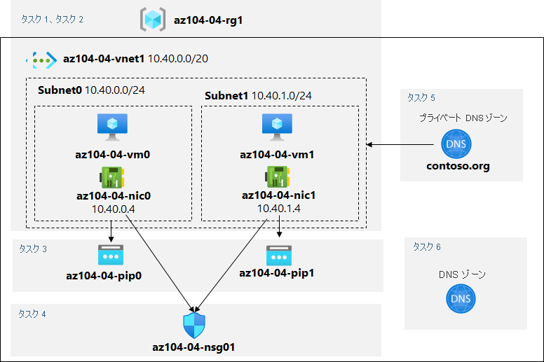

---
lab:
    title: '04 - 仮想ネットワークを実装する'
    module: 'モジュール 04 – バーチャル ネットワーク'
---

# ラボ 04 - 仮想ネットワークを実装する

# 受講生用ラボ マニュアル

## ラボ シナリオ

Azure 仮想ネットワークの機能について学習します。まず、Azure でいくつかの Azure 仮想マシンをホストする仮想ネットワークを作成するプランを立てます。ネットワーク ベースのセグメンテーションを実装するため、仮想ネットワークの異なるサブネットにデプロイします。また、プライベート IP アドレスとパブリック IP アドレスが時間の経過とともに変更されないようにする必要もあります。Contoso のセキュリティ要件に準拠するには、インターネットからアクセスできる Azure 仮想マシンのパブリック エンドポイントを保護する必要があります。最後に、仮想ネットワーク内とインターネットからの両方で、Azure 仮想マシンの DNS 名前解決を実装する必要があります。

## 目標

このラボでは次の内容を学習します。

+ タスク 1: 仮想ネットワークを作成および構成する
+ タスク 2: 仮想マシンを仮想ネットワークにデプロイする
+ タスク 3: Azure VM のプライベート IP アドレスとパブリック IP アドレスを構成する
+ タスク 4: ネットワーク セキュリティ グループを構成する
+ タスク 5: 内部の名前解決に Azure DNS を構成する
+ タスク 6: 外部の名前解決に Azure DNS を構成する

## 推定時間: 40 分

## アーキテクチャの図



## 手順

### 演習 1

#### タスク 1: 仮想ネットワークを作成および構成する

このタスクでは、Azure portal を使用して、複数のサブネットを持つ仮想ネットワークを作成します。

1. [Azure Portal](https://portal.azure.com) にサインインします。

1. Azure portal で、**「仮想ネットワーク」** を検索して選択し、**「仮想ネットワーク」** ブレードで **「+ 作成」** をクリックします。

1. 仮想ネットワークを次の設定で作成します (その他の設定は既定値のままにします)。

    | 設定 | 値 |
    | --- | --- |
    | サブスクリプション | このラボで使用する Azure サブスクリプションの名前 |
    | リソース グループ | **新しい**リソース グループ **az104-04-rg1** の名前 |
    | 名前 | **az104-04-vnet1** |
    | リージョン | このラボで使用するサブスクリプションで使用できる Azure リージョンの名前 |

1. **「次へ : IP アドレス」** をクリックして、次の値を入力します

    | 設定 | 値 |
    | --- | --- |
    | IPv4 アドレス空間 | **10.40.0.0/20** |

1. **「+ サブネットの追加」** をクリックして、次の値を入力してから、**「追加」** をクリックします

    | 設定 | 値 |
    | --- | --- |
    | サブネット名 | **subnet0** |
    | サブネット アドレス範囲 | **10.40.0.0/24** |

1. 既定値をそのまま使用し、**「確認および作成」** をクリックします。検証を実行し、もう一度 **「作成」** をクリックしてデプロイを送信します。

    >**注:** 仮想ネットワークがプロビジョニングされるのを待ちます。通常は 1 分もかかりません。

1. **「リソースに移動」** をクリックします

1. **「az104-04-vnet1** 仮想ネットワーク」ブレードで、**「サブネット」** をクリックし、**「+ サブネット」** をクリックします。

1. サブネットを次の設定で作成します (その他の設定は既定値のままにします)。

    | 設定 | 値 |
    | --- | --- |
    | 名前 | **subnet1** |
    | アドレス範囲 (CIDR ブロック) | **10.40.1.0/24** |
    | ネットワーク セキュリティ グループ | **None** |
    | ルート テーブル | **None** |

1. 「**保存**」をクリックする

#### タスク 2: 仮想マシンを仮想ネットワークにデプロイする

このタスクでは、ARM テンプレートを使用して、Azure 仮想マシンを仮想ネットワークの異なるサブネットにデプロイします。

1. Azure portal の右上にあるアイコンをクリックして **Azure Cloud Shell** を開きます。

1. **Bash** や **PowerShell** のどちらかを選択するためのプロンプトが表示されたら、**PowerShell** を選択します。

    >**注**: **Cloud Shell** の初回起動時に 「**ストレージがマウントされていません**」 というメッセージが表示された場合は、このラボで使用しているサブスクリプションを選択し、「**ストレージの作成**」 を選択します。

1. Cloud Shell ウィンドウのツールバーで、**「ファイルのアップロード/ダウンロード」** アイコンをクリックし、ドロップダウン メニューで **「アップロード」** をクリックして、ファイル **\\Allfiles\\Labs\\04\\az104-04-vms-loop-template.json** と **\\Allfiles\\Labs\\04\\az104-04-vms-loop-parameters.json** を Cloud Shell ホーム ディレクトリにアップロードします。

    >**注**: 各ファイルを別々にアップロードする必要がある場合があります。

1. 「Cloud Shell」 ウィンドウで次のコマンドを実行して、アップロードしたテンプレートとパラメーター ファイルを使用して 2 つの仮想マシンをデプロイします。

   ```powershell
   $rgName = 'az104-04-rg1'

   New-AzResourceGroupDeployment `
      -ResourceGroupName $rgName `
      -TemplateFile $HOME/az104-04-vms-loop-template.json `
      -TemplateParameterFile $HOME/az104-04-vms-loop-parameters.json
   ```

    >**注**: ARM テンプレートをデプロイするこの方法では、Azure PowerShell を使用します。同等の Azure CLI コマンド **az deployment create** を実行して、同じタスクを実行することもできます (詳細については、「[Resource Manager テンプレートおよび Azure CLI を使用するリソースのデプロイ](https://docs.microsoft.com/ja-jp/azure/azure-resource-manager/templates/deploy-cli)」を参照してください)。

    >**注**: 次のタスクに進む前に、デプロイが完了するまで待機します。これにはおよそ 2 分かかります。

    >**注**: 「リージョン内の VM サイズが利用できません」というメッセージが表示されたら、次の手順に従います。
    > 1. CloudShell で `{}` ボタンをクリックして、左側のバーから **az104-04-vms-loop-parameters.json** を選択して、`vmSize` パラメーターの値をメモします。
    > 1. 'az104-04-rg1' リソース グループがデプロイされた場所をクリックします。CloudShell で、`az group show -n az104-04-rg1 --query location` を実行して、それを取得します。
    > 1. CloudShell で、`az vm list-skus --location <Replace with your location> -o table --query "[? contains(name,'Standard_D2s')].name"` を実行します。
    > 1. `vmSize` パラメーターの値を実行したコマンドが返す値のいずれかに置き換えます。
    > 1. `New-AzResourceGroupDeployment` コマンドをもう一度実行して、テンプレートを再デプロイします。上ボタンを数回押して、最後に実行したコマンドを表示することができます。

1. 「Cloud Shell」 ペインを閉じます。

#### タスク 3: Azure VM のプライベート IP アドレスとパブリック IP アドレスを構成する

このタスクでは、Azure 仮想マシンのネットワーク インターフェイスに割り当てられたパブリック IP アドレスとプライベート IP アドレスの静的割り当てを構成します。

   >**注**: プライベート IP アドレスとパブリック IP アドレスは、実際にネットワーク インターフェイスに割り当てられ、次に Azure 仮想マシンに接続されますが、Azure VM に割り当てられた IP アドレスを代わりに参照することもよくあります。

1. Azure portal で **「リソース グループ」** を検索して選択し、**「リソース グループ」** ブレードで **「az104-04-rg1」** をクリックします。

1. 「**az104-04-rg1** リソース グループ」 ブレードのリソースのリストで、「**az104-04-vnet1**」 をクリックします。

1. **「az104-04-vnet1** 仮想ネットワーク」ブレードで、**「接続デバイス」** セクションを確認し、仮想ネットワークに接続されている 2 つのネットワーク インターフェイス **az104-04-nic0** と **az104-04-nic1** があることを確認します。

1. 「**az104-04-nic0**」 をクリックし、「**az104-04-nic0**」 ブレードで 「**IP 構成**」をクリックします。

    >**注**: **ipconfig1** が動的プライベート IP アドレスで現在設定されていることを確認します。

1. IP 構成のリストで、「**ipconfig1**」 をクリックします。

1. **ipconfig1** ブレードの 「**パブリック IP アドレス設定**」 セクションで、「**関連付け**」 を選択し、「**+ 新規作成**」 をクリックして、次の設定を指定し、「**OK**」 をクリックします。

    | 設定 | 値 |
    | --- | --- |
    | 名前 | **az104-04-pip0** |
    | SKU | **標準** |

1. 「**ipconfig1**」 ブレードで 「**割り当て**」 を 「**静的**」 に設定し、「**IP アドレス**」 の既定値を **10.40.0.4** のままにします。

1. 「**ipconfig1**」 ブレードに戻り、変更を保存します。次の手順に進む前に、必ず保存操作が完了するのを待ってください。

1. 「**az104-04-vnet1**」 ブレードに戻ります。

1. 「**az104-04-nic1**」 をクリックし、「**az104-04-nic1**」 ブレードで 「**IP 構成**」 をクリックします。

    >**注**: **ipconfig1** が動的プライベート IP アドレスで現在設定されていることを確認します。

1. IP 構成のリストで、「**ipconfig1**」 をクリックします。

1. **ipconfig1** ブレードの 「**パブリック IP アドレス設定**」 セクションで、「**関連付け**」 を選択し、「**+ 新規作成**」 をクリックして、次の設定を指定し、「**OK**」 をクリックします。

    | 設定 | 値 |
    | --- | --- |
    | 名前 | **az104-04-pip1** |
    | SKU | **標準** |

1. 「**ipconfig1**」 ブレードで 「**割り当て**」 を 「**静的**」 に設定し、「**IP アドレス**」 の既定値を **10.40.1.4** のままにします。

1. 「**ipconfig1**」 ブレードに戻り、変更を保存します。

1. 「**az104-04-rg1** リソース グループ」 ブレードに戻り、そのリソースのリストで 「**az104-04-vm0**」 をクリックし、「**az104-04-vm0** 仮想マシン」 ブレードでパブリック IP アドレスのエントリをメモします。

1. 「**az104-04-rg1** リソース グループ」 ブレードに戻り、そのリソースのリストで 「**az104-04-vm1**」 をクリックし、「**az104-04-vm1** 仮想マシン」 ブレードでパブリック IP アドレスのエントリをメモします。

    >**注**: このラボの最後のタスクで、両方の IP アドレスが必要になります。

#### タスク 4: ネットワーク セキュリティ グループを構成する

このタスクでは、Azure 仮想マシンへの接続を制限できるように、ネットワーク セキュリティ グループを構成します。

1. Azure portal で 「**az104-04-rg1** リソース グループ」 ブレードに戻り、そのリソースのリストで 「**az104-04-vm0**」 をクリックします。

1. 「**az104-04-vm0** 概要」 ブレードで、「**接続**」 をクリックし、ドロップダウン メニューで 「**RDP**」 をクリックし、「**RDP を使用して接続する**」 ブレードで 「**パブリック IP アドレスを使用して RDP ファイルのダウンロード**」 をクリックし、プロンプトに従ってリモート デスクトップ セッションを開始します。

1. 接続の試行が失敗することに注意してください。

    >**注**: これは想定されたことです。既定では、Standard SKU のパブリック IP アドレスが割り当てられたネットワーク インターフェイスは、ネットワーク セキュリティ グループで保護されている必要があるためです。リモート デスクトップ接続を許可するには、インターネットからの受信 RDP トラフィックを明示的に許可するネットワーク セキュリティ グループを作成し、両方の仮想マシンのネットワーク インターフェイスに割り当てます。

1. Azure portal で 「**ネットワーク セキュリティ グループ**」 を検索して選択し、「**ネットワーク セキュリティ グループ**」 ブレードで 「**+ 作成**」 をクリックします。

1. ネットワーク セキュリティ グループを次の設定で作成します (その他の設定は既定値のままにします)。

    | 設定 | 値 |
    | --- | --- |
    | サブスクリプション | このラボで使用する Azure サブスクリプションの名前 |
    | リソース グループ | **az104-04-rg1** |
    | 名前 | **az104-04-nsg01** |
    | リージョン | このラボで他のすべてのリソースをデプロイする Azure リージョンの名前 |

1. 「**確認と作成**」 をクリックします。検証を実行し、「**作成**」 をクリックしてデプロイを送信します。

    >**注**: デプロイが完了するのを待ちます。これにはおよそ 2 分かかります。

1. 「デプロイ」 ブレードで 「**リソースに移動**」 をクリックして、「**az104-04-nsg01** ネットワーク セキュリティ グループ」 ブレードを開きます。

1. 「**az104-04-nsg01** ネットワーク セキュリティ グループ」 ブレードの 「**設定**」 セクションで、「**受信セキュリティ ルール**」 をクリックします。

1. 次の設定を使用して受信ルールを追加します (その他の設定は既定値のままにします)。

    | 設定 | 値 |
    | --- | --- |
    | ソース | **Any** |
    | ソース ポート範囲 | * |
    | 宛先 | **Any** |
    | サービス | **RDP** |
    | アクション | **Allow** |
    | 優先度 | **300** |
    | 名前 | **AllowRDPInBound** |

1. 「**az104-04-nsg01** ネットワーク セキュリティ グループ」 ブレードの 「**設定**」 セクションで、「**ネットワーク インターフェイス**」 をクリックし、「**+ 関連付け**」 をクリックします。

1. 「**az104-04-nsg01** ネットワーク セキュリティ グループ」 を 「**az104-04-nic0** ネットワーク インターフェイス」 および 「**az104-04-nic1** ネットワーク インターフェイス」 に関連付けます。

    >**注**: 新しく作成されたネットワーク セキュリティ グループのルールがネットワーク インターフェイス カードに適用されるまで、最大 5 分かかる場合があります。

1. 「**az104-04-vm0** 仮想マシン」 ブレードに戻ります。

    >**注**: 後続のステップで、ターゲット仮想マシンに正常に接続し、**受講生**のユーザー名とパスワード **Pa55w.rd1234** を使用してサインインできることを確認します。

1. **「az104-04-vm0」** ブレードで、**「接続」** をクリックし、**「RDP」** をクリックします。**「RDP を使用して接続する」** ブレードで **「パブリック IP アドレスを使用して RDP ファイルのダウンロード」** をクリックし、プロンプトに従ってリモート デスクトップ セッションを開始します。

    >**注**: この手順では、Windows コンピューターからリモート デスクトップ経由で接続することを指します。Mac では、Mac App Store からリモート デスクトップ クライアントを使用でき、Linux コンピューターでは、オープンソースの RDP クライアント ソフトウェアを使用できます。

    >**注**: ターゲット仮想マシンに接続する際は、警告メッセージを無視できます。

1. プロンプトが表示されたら、**受講生**のユーザー名と **Pa55w.rd1234** パスワードを使用してサインインします。

    >**注**: リモート デスクトップ セッションを開いたままにします。これは、次のタスクで必要になります。

#### タスク 5: 内部の名前解決に Azure DNS を構成する

このタスクでは、Azure プライベート DNS ゾーンを使用して、仮想ネットワーク内で DNS 名前解決を構成します。

1. Azure portal で、「**プライベート DNS ゾーン**」 を検索して選択し、「**プライベート DNS ゾーン**」 ブレードで 「**+ 作成**」 をクリックします。

1. プライベート DNS ゾーンを次の設定で作成します (その他の設定は既定値のままにします)。

    | 設定 | 値 |
    | --- | --- |
    | サブスクリプション | このラボで使用する Azure サブスクリプションの名前 |
    | リソース グループ | **az104-04-rg1** |
    | 名前 | **contoso.org** |

1. 「**確認と作成**」をクリックします。検証を実行し、もう一度「**作成**」をクリックしてデプロイを送信します。

    >**注**: プライベート DNS ゾーンが作成されるのを待ちます。これにはおよそ 2 分かかります。

1. 「**リソースに移動**」 をクリックして 「**contoso.org** DNS プライベート ゾーン」 ブレードを開きます。

1. **「contoso.org** プライベート DNS ゾーン」ブレードの **「設定」** セクションで、**「仮想ネットワーク リンク」** をクリックします。

1. **「+ 追加」** をクリックして、仮想ネットワーク リンクを次の設定で作成します (他の設定は既定値のままにします)。

    | 設定 | 値 |
    | --- | --- |
    | リンク名 | **az104-04-vnet1-link** |
    | サブスクリプション | このラボで使用する Azure サブスクリプションの名前 |
    | 仮想ネットワーク | **az104-04-vnet1** |
    | 自動登録を有効にする | 有効 |

1. **「OK」** をクリックします。

    >**注:** 仮想ネットワーク リンクが作成されるまで待ちます。通常は 1 分もかかりません。

1. **「contoso.org** プライベート DNS ゾーン」ブレードのサイドバーで、**「概要」** をクリックします。

1. **az104-04-vm0** および **az104-04-vm1** の DNS レコードが、レコード セットのリストに**自動登録**として表示されることを確認 します。

    >**注:** レコード セットが表示されない場合は、数分待ってからページを更新する必要があります。

1. リモート デスクトップ セッションを **az104-04-vm0** に切り替えて、「**スタート**」 ボタンを右クリックし、右クリック メニューで、「**Windows PowerShell (管理者)**」 をクリックします。

1. Windows PowerShell コンソール ウィンドウで次のコマンドを実行して、新しく作成したプライベート DNS ゾーン内の内部名前解決をテストします。

   ```powershell
   nslookup az104-04-vm0.contoso.org
   nslookup az104-04-vm1.contoso.org
   ```

1. コマンドの出力に、**az104-04-vm1** (**10.40.1.4**) のプライベート IP アドレスが含まれていることを確認します。

#### タスク 6: 外部の名前解決に Azure DNS を構成する

このタスクでは、Azure パブリック DNS ゾーンを使用して外部 DNS 名前解決を構成します。

1. **SEA-DEV** ラボ システムの Web ブラウザーで新しいタブを開き、<https://www.godaddy.com/domains/domain-name-search> に移動します。

1. ドメイン名検索を使用して、使用されていないドメイン名を識別します。

1. Azure portal で 「**DNS ゾーン**」 を検索して選択し、「**DNS ゾーン**」 ブレードで 「**+ 追加**」 をクリックします。

1. DNS ゾーンを次の設定で作成します (その他の設定は既定値のままにします)。

    | 設定 | 値 |
    | --- | --- |
    | サブスクリプション | このラボで使用する Azure サブスクリプションの名前 |
    | リソース グループ | **az104-04-rg1** |
    | 名前 | このタスクで前に指定した DNS ドメイン名 |

1. 「確認と作成」 をクリックします。検証を実行し、もう一度 「作成」 をクリックしてデプロイを送信します。

    >**注**: DNS ゾーンが作成されるのを待ちます。これにはおよそ 2 分かかります。

1. 「**リソースに移動**」 をクリックして、新しく作成した DNS ゾーンのブレードを開きます。

1. 「DNS ゾーン」 ブレードで、「**+ レコード セット**」 をクリックします。

1. レコード セットを次の設定で追加します (その他の設定は既定値のままにします)。

    | 設定 | 値 |
    | --- | --- |
    | 名前 | **az104-04-vm0** |
    | 種類 | **A** |
    | エイリアスのレコード セット | **不可** |
    | TTL | **1** |
    | TTL の単位 | **時間** |
    | IP アドレス | このラボの 3 番目の演習で特定した **az104-04-vm0** のパブリック IP アドレス |

1. 「**OK**」 をクリックします

1. 「DNS ゾーン」 ブレードで、「**+ レコード セット**」 をクリックします。

1. レコード セットを次の設定で追加します (その他の設定は既定値のままにします)。

    | 設定 | 値 |
    | --- | --- |
    | 名前 | **az104-04-vm1** |
    | 種類 | **A** |
    | エイリアスのレコード セット | **不可** |
    | TTL | **1** |
    | TTL の単位 | **時間** |
    | IP アドレス | このラボの 3 番目の演習で特定した **az104-04-vm1** のパブリック IP アドレス |

1. 「**OK**」 をクリックします

1. 「DNS ゾーン」ブレードで、「**ネーム サーバー 1**」のエントリの名前をメモします。

1. Azure portal で、右上にあるアイコンをクリックして、**「Cloud Shell」** の **「PowerShell」** セッションを開きます。

1. 「Cloud Shell」ペインで次のコマンドを実行して、 新しく作成した DNS ゾーンに設定されている「**az104-04-vm0**」 DNS レコード セットの外部名前解決をテストします (プレースホルダー `[Name server 1]` をこのタスクで前にメモした **ネーム サーバー 1** の名前に、プレースホルダー `[domain name]` をこのタスクで前に作成した DNS ドメインに置き換えます)。

   ```powershell
   nslookup az104-04-vm0.[domain name] [Name server 1]
   ```

1. コマンドの出力に、**az104-04-vm0** のパブリック IP アドレスが含まれていることを確認します。

1. 「Cloud Shell」ペインで次のコマンドを実行して、 新しく作成した DNS ゾーンに設定されている「**az104-04-vm1**」 DNS レコード セットの外部名前解決をテストします (プレースホルダー `[Name server 1]` をこのタスクで前にメモした **ネーム サーバー 1** の名前に、プレースホルダー `[domain name]` をこのタスクで前に作成した DNS ドメインに置き換えます)。

   ```powershell
   nslookup az104-04-vm1.[domain name] [Name server 1]
   ```

1. コマンドの出力に、**az104-04-vm1** のパブリック IP アドレスが含まれていることを確認します。

#### リソースをクリーン アップする

   >**注**: 新しく作成した Azure リソースのうち、使用しないリソースは必ず削除してください。使用しないリソースを削除し、予期しないコストが発生しないようにします。

1. Azure portal の **「Cloud Shell」** ウィンドウで **「PowerShell」** セッションを開きます。

1. 次のコマンドを実行して、このモジュールのラボ全体で作成したすべてのリソース グループのリストを表示します。

   ```powershell
   Get-AzResourceGroup -Name 'az104-04*'
   ```

1. 次のコマンドを実行して、このモジュールのラボ全体で作成したすべてのリソース グループのリストを削除します。

   ```powershell
   Get-AzResourceGroup -Name 'az104-04*' | Remove-AzResourceGroup -Force -AsJob
   ```

    >**注**: コマンドは非同期で実行されるので (-AsJob パラメーターによって決定されます)、別の PowerShell コマンドを同一 PowerShell セッション内ですぐに実行できますが、リソース グループが実際に削除されるまでに数分かかります。

#### 確認

このラボでは次の内容を学習しました。

+ 仮想ネットワークを作成して構成しました
+ 仮想マシンを仮想ネットワークにデプロイしました
+ Azure VM のプライベート IP アドレスとパブリック IP アドレスを構成しました
+ ネットワーク セキュリティ グループを構成しました
+ Azure DNS を内部の名前解決用に構成しました
+ Azure DNS を外部の名前解決用に構成しました
