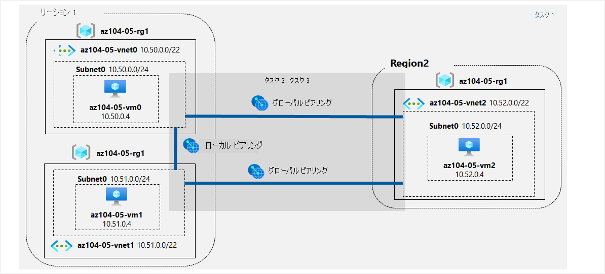

---
lab:
  title: 05 - サイト間接続を実装する
  module: Administer Intersite Connectivity
---

# <a name="lab-05---implement-intersite-connectivity"></a>ラボ 05 - サイト間の接続性を実装する
# <a name="student-lab-manual"></a>受講生用ラボ マニュアル

## <a name="lab-scenario"></a>ラボのシナリオ

Contoso では、ボストン、ニューヨーク、シアトルの各オフィスを、メッシュ ワイドエリア ネットワーク リンクを介して接続しており、各オフィスの間に完全な接続性を備えています。 Contoso のオンプレミス ネットワークのトポロジを反映したラボ環境を実装して、その機能を検証します。

                **メモ:** このラボをご自分のペースでクリックして進めることができる、 **[ラボの対話型シミュレーション](https://mslabs.cloudguides.com/guides/AZ-104%20Exam%20Guide%20-%20Microsoft%20Azure%20Administrator%20Exercise%209)** が用意されています。 対話型シミュレーションとホストされたラボの間に若干の違いがある場合がありますが、示されている主要な概念とアイデアは同じです。 

## <a name="objectives"></a>目標

このラボでは、次のことを行います。

+ タスク 1:ラボ環境をプロビジョニングする
+ タスク 2:ローカルおよびグローバルバーチャル ネットワーク ピアリングを構成する
+ タスク 3:サイト間接続をテストする

## <a name="estimated-timing-30-minutes"></a>推定時間:30 分

## <a name="architecture-diagram"></a>アーキテクチャの図



### <a name="instructions"></a>Instructions

#### <a name="task-1-provision-the-lab-environment"></a>タスク 1:ラボ環境をプロビジョニングする

このタスクでは、3 つの仮想マシンをそれぞれ別のバーチャル ネットワークにデプロイし、そのうちの 2 つを同じ Azure リージョンに配置し、3 つ目の仮想マシンを別の Azure リージョンにデプロイします。

1. [Azure portal](https://portal.azure.com) にサインインします。

1. Azure portal の右上にあるアイコンをクリックして **Azure Cloud Shell** を開きます。

1. **Bash** または **PowerShell** の選択を求めるメッセージが表示されたら、 **[PowerShell]** を選択します。

    >**注**: **Cloud Shell** の初回起動時に "**ストレージがマウントされていません**" というメッセージが表示された場合は、このラボで使用しているサブスクリプションを選択し、**[ストレージの作成]** を選択します。

1. [Cloud Shell] ペインのツールバーで、 **[ファイルのアップロード/ダウンロード]** アイコンをクリックし、ドロップダウン メニューで **[アップロード]** をクリックして、ファイル **\\Allfiles\\Labs\\05\\az104-05-vnetvm-loop-template.json** と **\\Allfiles\\Labs\\05\\az104-05-vnetvm-loop-parameters.json** を Cloud Shell のホーム ディレクトリにアップロードします。

1. アップロードしたばかりの**パラメーター** ファイルを編集し、パスワードを変更します。 シェルでのファイルの編集に関してヘルプが必要な場合は、インストラクターに相談してください。 ベスト プラクティスとして、パスワードなどのシークレットは、キー コンテナーに安全に保存する必要があります。 

1. Cloud Shell ペインから、以下を実行して、ラボ環境をホストするリソース グループを作成します。 最初の 2 つの仮想ネットワークと 1 組の仮想マシンが [Azure_region_1] にデプロイされます。 3 番目の仮想ネットワークと 3 番目の仮想マシンは、同じリソース グループではあるものの、別の [Azure_region_2] にデプロイされます。 (角かっこを含む [Azure_region_1] および [Azure_region_2] プレースホルダーを、これらの Azure 仮想マシンをデプロイする予定の 2 つの異なる Azure リージョンの名前に置き換えます。 たとえば、$location 1 = 'eastus' です。 Get-AzLocation を使用して、すべての場所を一覧表示できます)。

   ```powershell
   $location1 = 'eastus'

   $location2 = 'westus'

   $rgName = 'az104-05-rg1'

   New-AzResourceGroup -Name $rgName -Location $location1
   ```

   >**注**:上記で使ったリージョンは、このラボを最後に公式にレビューしたときにテスト済みであり、機能することがわかっています。 別のリージョンを使いたい場合、または機能しなくなった場合は、Standard D2Sv3 仮想マシンをデプロイできる 2 つの異なるリージョンを決める必要があります。
   >
   >Azure リージョンを識別するには、Cloud Shell の PowerShell セッションから **(Get-AzLocation).Location** を実行します。
   >
   >使う 2 つのリージョンを決めたら、それぞれのリージョンに対して Cloud Shell で次のコマンドを実行し、Standard D2Sv3 仮想マシンをデプロイできることを確認します。
   >
   >```az vm list-skus --location <Replace with your location> -o table --query "[? contains(name,'Standard_D2s')].name" ```
   >
   >コマンドから結果が返されない場合は、別のリージョンを選ぶ必要があります。 2 つの適切なリージョンを決めたら、前述のコード ブロック内のリージョンを調整することができます。

1. [Cloud Shell] ウィンドウで、次のコマンドを実行して 3 つのバーチャル ネットワークを作成し、アップロードしたテンプレートとパラメーター ファイルを使用して仮想マシンをデプロイします。

   ```powershell
   New-AzResourceGroupDeployment `
      -ResourceGroupName $rgName `
      -TemplateFile $HOME/az104-05-vnetvm-loop-template.json `
      -TemplateParameterFile $HOME/az104-05-vnetvm-loop-parameters.json `
      -location1 $location1 `
      -location2 $location2
   ```

    >**注**: デプロイが完了するまで待ってから、次の手順に進んでください。 これには 2 分ほどかかります。

1. [Cloud Shell] ペインを閉じます。

#### <a name="task-2-configure-local-and-global-virtual-network-peering"></a>タスク 2:ローカルおよびグローバルバーチャル ネットワーク ピアリングを構成する

このタスクでは、前のタスクでデプロイしたバーチャル ネットワーク間で、ローカル ピアリングとグローバル ピアリングを構成します。

1. Azure portal で、 **[仮想ネットワーク]** を検索して選択します。

1. 前のタスクで作成したバーチャル ネットワークを確認し、最初の 2 つが同じ Azure リージョンに配置され、3 番目が別の Azure リージョンに存在することを確認します。

    >**注**:3 つのバーチャル ネットワークのデプロイに使用したテンプレートに、3 つのバーチャル ネットワークの IP アドレス範囲が重複しないようにします。

1. バーチャル ネットワークのリストで、**[az104-05-vnet0]** をクリックします。

1. **[az104-05-vnet0** バーチャル ネットワーク] ブレードの **[設定]** セクションで **[ピアリング]** をクリックしてから、**[+ 追加]** をクリックします。

1. 次の設定でピアリングを追加し (他のユーザーには既定値を残します)、**[追加]** をクリックします。

    | 設定 | 値|
    | --- | --- |
    | この仮想ネットワーク: ピアリング リンク名 | **az104-05-vnet0_to_az104-05-vnet1** |
    | このバーチャル ネットワーク:リモート バーチャル ネットワークのトラフィック | **許可 (既定)** |
    | このバーチャル ネットワーク:リモート バーチャル ネットワークから転送されたトラフィック | **この仮想ネットワークの外部から発信されるトラフィックをブロックする** |
    | 仮想ネットワーク ゲートウェイ | **なし** |
    | リモート仮想ネットワーク: ピアリング リンク名 | **az104-05-vnet1_to_az104-05-vnet0** |
    | 仮想ネットワークのデプロイ モデル | **リソース マネージャー** |
    | リソース ID を知っている | 未選択 |
    | サブスクリプション | このラボで使用している Azure サブスクリプションの名前 |
    | 仮想ネットワーク | **az104-05-vnet1** |
    | [Traffic to remote virtual network](リモート仮想ネットワークへのトラフィック) | **許可 (既定)** |
    | [Traffic forwarded from remote virtual network](リモート仮想ネットワークから転送されるトラフィック) | **この仮想ネットワークの外部から発信されるトラフィックをブロックする** |
    | 仮想ネットワーク ゲートウェイ | **なし** |

    >**注**:この手順では、az104-05-vnet0 から az104-05-vnet1、az104-05-vnet1 から az104-05-vnet0 までの 2 つのローカル ピアリングを確立します。

    >**注**:前のタスクで作成したバーチャル ネットワークが表示されない Azure Portal インターフェイスで問題が発生した場合は、Cloud Shell から次のPowerShell コマンドを実行して、ピアリングを構成できます。
    
   ```powershell
   $rgName = 'az104-05-rg1'

   $vnet0 = Get-AzVirtualNetwork -Name 'az104-05-vnet0' -ResourceGroupName $rgname

   $vnet1 = Get-AzVirtualNetwork -Name 'az104-05-vnet1' -ResourceGroupName $rgname

   Add-AzVirtualNetworkPeering -Name 'az104-05-vnet0_to_az104-05-vnet1' -VirtualNetwork $vnet0 -RemoteVirtualNetworkId $vnet1.Id

   Add-AzVirtualNetworkPeering -Name 'az104-05-vnet1_to_az104-05-vnet0' -VirtualNetwork $vnet1 -RemoteVirtualNetworkId $vnet0.Id
   ``` 

1. **[az104-05-vnet0** バーチャル ネットワーク] ブレードの **[設定]** セクションで **[ピアリング]** をクリックしてから、**[+ 追加]** をクリックします。

1. 次の設定でピアリングを追加し (他のユーザーには既定値を残します)、**[追加]** をクリックします。

    | 設定 | 値|
    | --- | --- |
    | この仮想ネットワーク: ピアリング リンク名 | **az104-05-vnet0_to_az104-05-vnet2** |
    | このバーチャル ネットワーク:リモート バーチャル ネットワークのトラフィック | **許可 (既定)** |
    | このバーチャル ネットワーク:リモート バーチャル ネットワークから転送されたトラフィック | **この仮想ネットワークの外部から発信されるトラフィックをブロックする** |
    | 仮想ネットワーク ゲートウェイ | **なし** |
    | リモート仮想ネットワーク: ピアリング リンク名 | **az104-05-vnet2_to_az104-05-vnet0** |
    | 仮想ネットワークのデプロイ モデル | **リソース マネージャー** |
    | リソース ID を知っている | 未選択 |
    | サブスクリプション | このラボで使用している Azure サブスクリプションの名前 |
    | 仮想ネットワーク | **az104-05-vnet2** |
    | [Traffic to remote virtual network](リモート仮想ネットワークへのトラフィック) | **許可 (既定)** |
    | [Traffic forwarded from remote virtual network](リモート仮想ネットワークから転送されるトラフィック) | **この仮想ネットワークの外部から発信されるトラフィックをブロックする** |
    | 仮想ネットワーク ゲートウェイ | **なし** |

    >**注**:このステップでは、az104-05-vnet0 から az104-05-vnet2、az104-05-vnet2 から az104-05-vnet0 までの 2 つのグローバル ピアリングを確立します。

    >**注**:前のタスクで作成したバーチャル ネットワークが表示されない Azure Portal インターフェイスで問題が発生した場合は、Cloud Shell から次のPowerShell コマンドを実行して、ピアリングを構成できます。
    
   ```powershell
   $rgName = 'az104-05-rg1'

   $vnet0 = Get-AzVirtualNetwork -Name 'az104-05-vnet0' -ResourceGroupName $rgname

   $vnet2 = Get-AzVirtualNetwork -Name 'az104-05-vnet2' -ResourceGroupName $rgname

   Add-AzVirtualNetworkPeering -Name 'az104-05-vnet0_to_az104-05-vnet2' -VirtualNetwork $vnet0 -RemoteVirtualNetworkId $vnet2.Id

   Add-AzVirtualNetworkPeering -Name 'az104-05-vnet2_to_az104-05-vnet0' -VirtualNetwork $vnet2 -RemoteVirtualNetworkId $vnet0.Id
   ``` 

1. **[バーチャル ネットワーク]** ブレードに戻り、バーチャル ネットワークの一覧で **[az104-05-vnet1]** をクリックします。

1. **az104-05-vnet1** 仮想ネットワーク ブレードの **[設定]** セクションで、 **[ピアリング]** をクリックしてから、 **[+ 追加]** をクリックします。

1. 次の設定でピアリングを追加し (他のユーザーには既定値を残します)、**[追加]** をクリックします。

    | 設定 | 値|
    | --- | --- |
    | この仮想ネットワーク: ピアリング リンク名 | **az104-05-vnet1_to_az104-05-vnet2** |
    | このバーチャル ネットワーク:リモート バーチャル ネットワークのトラフィック | **許可 (既定)** |
    | このバーチャル ネットワーク:リモート バーチャル ネットワークから転送されたトラフィック | **この仮想ネットワークの外部から発信されるトラフィックをブロックする** |
    | 仮想ネットワーク ゲートウェイ | **なし** |
    | リモート仮想ネットワーク: ピアリング リンク名 | **az104-05-vnet2_to_az104-05-vnet1** |
    | 仮想ネットワークのデプロイ モデル | **リソース マネージャー** |
    | リソース ID を知っている | 未選択 |
    | サブスクリプション | このラボで使用している Azure サブスクリプションの名前 |
    | 仮想ネットワーク | **az104-05-vnet2** |
    | [Traffic to remote virtual network](リモート仮想ネットワークへのトラフィック) | **許可 (既定)** |
    | [Traffic forwarded from remote virtual network](リモート仮想ネットワークから転送されるトラフィック) | **この仮想ネットワークの外部から発信されるトラフィックをブロックする** |
    | 仮想ネットワーク ゲートウェイ | **なし** |

    >**注**:このステップでは、az104-05-vnet1 から az104-05-vnet2、az104-05-vnet2 から az104-05-vnet1 までの 2 つのグローバル ピアリングを確立します。

    >**注**:前のタスクで作成したバーチャル ネットワークが表示されない Azure Portal インターフェイスで問題が発生した場合は、Cloud Shell から次のPowerShell コマンドを実行して、ピアリングを構成できます。
    
   ```powershell
   $rgName = 'az104-05-rg1'

   $vnet1 = Get-AzVirtualNetwork -Name 'az104-05-vnet1' -ResourceGroupName $rgname

   $vnet2 = Get-AzVirtualNetwork -Name 'az104-05-vnet2' -ResourceGroupName $rgname

   Add-AzVirtualNetworkPeering -Name 'az104-05-vnet1_to_az104-05-vnet2' -VirtualNetwork $vnet1 -RemoteVirtualNetworkId $vnet2.Id

   Add-AzVirtualNetworkPeering -Name 'az104-05-vnet2_to_az104-05-vnet1' -VirtualNetwork $vnet2 -RemoteVirtualNetworkId $vnet1.Id
   ``` 

#### <a name="task-3-test-intersite-connectivity"></a>タスク 3:サイト間接続をテストする

このタスクでは、前のタスクでローカル ピアリングとグローバル ピアリングを介して接続した 3 つのバーチャル ネットワーク上の仮想マシン間の接続性をテストします。

1. Azure portal で、**[仮想マシン]** を検索して選択します。

1. 仮想マシンのリストで、**[az104-05-vm0]** をクリックします。

1. **az104-05-vm0** ブレードで、 **[接続]** をクリックし、ドロップダウン メニューで **[RDP]** をクリックし、 **[RDP を使用して接続する]** ブレードで **[RDP ファイルのダウンロード]** をクリックし、プロンプトに従ってリモート デスクトップ セッションを開始します。

    >**注**:この手順では、Windows コンピューターからリモート デスクトップ経由で接続することを指します。 Mac では、Mac App Store からリモート デスクトップ クライアントを使用でき、Linux コンピューターでは、オープンソースの RDP クライアント ソフトウェアを使用できます。

    >**注**:ターゲット仮想マシンに接続する際は、警告メッセージを無視できます。

1. メッセージが表示されたら、 **[学生]** のユーザー名とパラメーター ファイルのパスワードを使用してサインインします。 

1. **az104-05-vm0** へのリモート デスクトップ セッション内で、**[スタート]** ボタンを右クリックし、右クリック メニューで **[Windows PowerShell (管理者)]** をクリックします。

1. Windows PowerShell コンソール ウィンドウで、次のコマンドを実行して、TCP ポート 3389 での **az104-05-vm1** (プライベート IP アドレスが **10.51.0.4**) への接続性をテストします。

   ```powershell
   Test-NetConnection -ComputerName 10.51.0.4 -Port 3389 -InformationLevel 'Detailed'
   ```

    >**注**:このテストで TCP 3389 を使用するのは、このポートがオペレーティング システムのファイアウォールによって既定で許可されているためです。

1. コマンドの出力を調べて、接続が正常に行われたことを確認します。

1. Windows PowerShell コンソール ウィンドウで次のコマンドを実行して、**az104-05-vm2** (プライベート IP アドレスが **10.52.0.4**) への接続性をテストします。

   ```powershell
   Test-NetConnection -ComputerName 10.52.0.4 -Port 3389 -InformationLevel 'Detailed'
   ```

1. ラボ コンピューターの Azure portal に戻り、**[仮想マシン]** ブレードに戻ります。

1. 仮想マシンの一覧で、**az104-05-vm1** をクリックします。

1. **az104-05-vm1** ブレードで、 **[接続]** をクリックし、ドロップダウン メニューで **[RDP]** をクリックし、 **[RDP を使用して接続する]** ブレードで **[RDP ファイルのダウンロード]** をクリックし、プロンプトに従ってリモート デスクトップ セッションを開始します。

    >**注**:この手順では、Windows コンピューターからリモート デスクトップ経由で接続することを指します。 Mac では、Mac App Store からリモート デスクトップ クライアントを使用でき、Linux コンピューターでは、オープンソースの RDP クライアント ソフトウェアを使用できます。

    >**注**:ターゲット仮想マシンに接続する際は、警告メッセージを無視できます。

1. メッセージが表示されたら、 **[学生]** のユーザー名とパラメーター ファイルのパスワードを使用してサインインします。 

1. **az104-05-vm1** へのリモート デスクトップ セッション内で、 **[スタート]** ボタンを右クリックし、右クリック メニューで **[Windows PowerShell (管理者)]** をクリックします。

1. Windows PowerShell コンソール ウィンドウで、次のコマンドを実行して、TCP ポート 3389 での **az104-05-vm2** (プライベート IP アドレスが **10.52.0.4**) への接続性をテストします。

   ```powershell
   Test-NetConnection -ComputerName 10.52.0.4 -Port 3389 -InformationLevel 'Detailed'
   ```

    >**注**:このテストで TCP 3389 を使用するのは、このポートがオペレーティング システムのファイアウォールによって既定で許可されているためです。

1. コマンドの出力を調べて、接続が正常に行われたことを確認します。

#### <a name="clean-up-resources"></a>リソースをクリーンアップする

>**注**:新規に作成し、使用しなくなったすべての Azure リソースを削除することを忘れないでください。 使用していないリソースを削除することで、予期しない料金が発生しなくなります。

>**注**:ラボのリソースをすぐに削除できなくても心配する必要はありません。 リソースに依存関係が存在し、削除に時間がかかる場合があります。 リソースの使用状況を監視することは管理者の一般的なタスクであるため、ポータルでリソースを定期的にチェックして、クリーンアップの進捗を確認するようにしてください。 

1. Azure portal で、**[Cloud Shell]** ペイン内に **PowerShell** セッションを開きます。

1. 次のコマンドを実行して、このモジュールのラボ全体で作成したすべてのリソース グループのリストを表示します。

   ```powershell
   Get-AzResourceGroup -Name 'az104-05*'
   ```

1. 次のコマンドを実行して、このモジュールのラボ全体を通して作成したすべてのリソース グループを削除します。

   ```powershell
   Get-AzResourceGroup -Name 'az104-05*' | Remove-AzResourceGroup -Force -AsJob
   ```

    >**注**:このコマンドは非同期で実行されるため (-AsJob パラメーターによって決定されます)、同じ PowerShell セッション内で直後に別の PowerShell コマンドを実行できますが、リソース グループが実際に削除されるまでに数分かかります。

#### <a name="review"></a>確認

このラボでは、次のことを行いました。

+ ラボ環境をプロビジョニングしました
+ ローカルバーチャル ネットワーク ピアリングおよびグローバルバーチャル ネットワーク ピアリングを構成しました。
+ サイト間の接続性をテストしました
