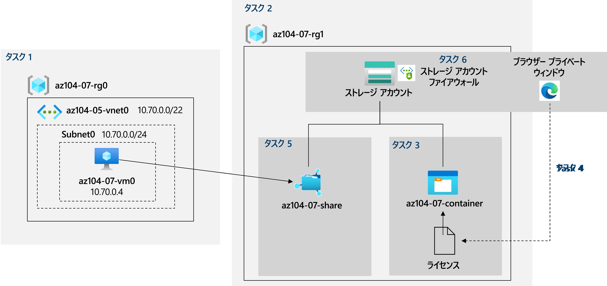

---
lab:
  title: 07 - Azure Storage を管理する
  module: Administer Azure Storage
---

# <a name="lab-07---manage-azure-storage"></a>ラボ 7 - Azure Storageを管理する
# <a name="student-lab-manual"></a>受講生用ラボ マニュアル

## <a name="lab-scenario"></a>ラボのシナリオ

現在オンプレミスのデータ ストアに存在するファイルを格納するために、Azure Storage の使用を検討する必要があります。 これらのファイルの大部分は頻繁にアクセスされませんが、いくつかの例外があります。 アクセス頻度の低いファイルを低価格のストレージ層に配置することで、ストレージのコストを最小限に抑えたいと考えるかもしれません。 ネットワーク アクセス、認証、認可、レプリケーションなど、Azure Storage が提供するさまざまな保護メカニズムについても検討する予定です。 最後に、Azure Files サービスがオンプレミスのファイル共有をホストするのにどの程度適しているかを判断する必要があります。

                **メモ:** このラボをご自分のペースでクリックして進めることができる、 **[ラボの対話型シミュレーション](https://mslabs.cloudguides.com/guides/AZ-104%20Exam%20Guide%20-%20Microsoft%20Azure%20Administrator%20Exercise%2011)** が用意されています。 対話型シミュレーションとホストされたラボの間に若干の違いがある場合がありますが、示されている主要な概念とアイデアは同じです。 

## <a name="objectives"></a>目標

このラボでは、次のことを行います。

+ タスク 1:ラボ環境をプロビジョニングする
+ タスク 2:Azure Storage アカウントを作成し、構成する
+ タスク 3:Blob Storage を管理する
+ タスク 4:Azure Storage の認証と許可を管理する
+ タスク 5:Azure Files 共有を作成し、構成する
+ タスク 6:Azure Storage のネットワーク アクセスを管理する

## <a name="estimated-timing-40-minutes"></a>推定時間:40 分

## <a name="architecture-diagram"></a>アーキテクチャの図




## <a name="instructions"></a>Instructions

### <a name="exercise-1"></a>演習 1

#### <a name="task-1-provision-the-lab-environment"></a>タスク 1:ラボ環境をプロビジョニングする

このタスクでは、この課題の後半で使用する Azure 仮想マシンをデプロイします。

1. [Azure portal](https://portal.azure.com) にサインインします。

1. Azure portal の右上にあるアイコンをクリックして **Azure Cloud Shell** を開きます。

1. **Bash** または **PowerShell** の選択を求めるメッセージが表示されたら、 **[PowerShell]** を選択します。

    >**注**: **Cloud Shell** の初回起動時に **"ストレージがマウントされていません"** というメッセージが表示された場合は、このラボで使用しているサブスクリプションを選択し、**[ストレージの作成]** を選択します。

1. Cloud Shell ウィンドウのツールバーで、 **[ファイルのアップロード/ダウンロード]** アイコンをクリックし、ドロップダウン メニューで **[アップロード]** を選択して、ファイル **\\Allfiles\\Labs\\07\\az104-07-vm-template.json** および **\\Allfiles\\Labs\\07\\az104-07-vm-parameters.json** を Cloud Shell ホーム ディレクトリにアップロードします。

1. アップロードしたばかりの**パラメーター** ファイルを編集し、パスワードを変更します。 シェルでのファイルの編集に関してヘルプが必要な場合は、インストラクターに相談してください。 ベスト プラクティスとして、パスワードなどのシークレットは、キー コンテナーに安全に保存する必要があります。 

1. [Cloud Shell] ウィンドウから次のコマンドを実行して、仮想マシンをホストするリソース グループを作成します ('[Azure_region]' プレースホルダーを Azure 仮想マシンをデプロイする Azure リージョンの名前に置き換えます)。

    >**注**:Azure リージョンの名前を一覧表示するには、`(Get-AzLocation).Location` を実行します。
    >**メモ**:以下の各コマンドを個別に入力してください。

    ```powershell
    $location = '[Azure_region]'
    ```
  
    ```powershell
     $rgName = 'az104-07-rg0'
    ```

    ```powershell
    New-AzResourceGroup -Name $rgName -Location $location
    ```
    
1. [Cloud Shell] ペインから次のコマンドを実行し、アップロードされたテンプレートとパラメーター ファイルを使用して、仮想マシンをデプロイします。

   ```powershell
   New-AzResourceGroupDeployment `
      -ResourceGroupName $rgName `
      -TemplateFile $HOME/az104-07-vm-template.json `
      -TemplateParameterFile $HOME/az104-07-vm-parameters.json `
      -AsJob
   ```

    >**注**:デプロイが完了するのを待たずに、次のタスクに進みます。

    >**注**:VM サイズが利用できないというエラーが発生した場合、インストラクターにサポートを依頼し、次の手順を試してください。
    > 1. CloudShell で `{}` ボタンをクリックし、左側のバーから **az104-07-vm-parameters.json** を選択して、`vmSize` パラメーターの値をメモしておきます。
    > 1. "az104-04-rg1" リソース グループがデプロイされている場所を確認します。 CloudShell で `az group show -n az104-04-rg1 --query location` を実行して、それを取得することができます。
    > 1. CloudShell で `az vm list-skus --location <Replace with your location> -o table --query "[? contains(name,'Standard_D2s')].name"` を実行します。
    > 1. `vmSize` パラメーターの値を、先ほど実行したコマンドによって返された値のいずれかに置き換えます。
    > 1. 次に、`New-AzResourceGroupDeployment` コマンドを再度実行して、テンプレートを再デプロイします。 上方向ボタンを数回押して、最後に実行されたコマンドを上に持ってくることができます。

1. [Cloud Shell] ペインを閉じます。

#### <a name="task-2-create-and-configure-azure-storage-accounts"></a>タスク 2:Azure Storage アカウントを作成し、構成する

このタスクでは、Azure Storage アカウントを作成して構成します。

1. Azure portal で、「**ストレージ アカウント**」を検索して選択し、**[+ 作成]** をクリックします。

1. 「**ストレージ アカウントの作成**」ブレードの「**基本**」タブで、次の設定を指定します (他の設定は既定値のままにします)。

    | 設定 | 値 |
    | --- | --- |
    | サブスクリプション | このラボで使用している Azure サブスクリプションの名前 |
    | リソース グループ | **新しい** リソース グループ **az104-07-rg1** の名前 |
    | ストレージ アカウント名 | 文字と数字で構成される、長さが 3 から 24 のグローバルに一意の名前 |
    | リージョン | Azure ストレージ アカウントを作成できる Azure リージョンの名前  |
    | パフォーマンス | **Standard** |
    | 冗長性 | **geo 冗長ストレージ (GRS)** |

1. **[次へ: 詳細 >]** をクリックし、 **[ストレージ アカウントの作成]** ブレードの **[詳細]** タブで利用可能なオプションを確認し、既定値を受け入れ、 **[次へ: ネットワーク >]** を選択します。

1. **[ストレージ アカウントの作成]** ブレードの **[ネットワーク]** タブで、利用可能なオプションを確認し、既定のオプションである **[すべてのネットワークからのパブリック アクセスを有効にする]** を受け入れて、 **[次へ: データ保護 >]** をクリックします。

1. **[ストレージ アカウントの作成]** ブレードの **[データ保護]** タブで、利用可能なオプションを確認し、既定値を受け入れて、**[レビュー + 作成]** をクリックし、検証プロセスが完了するのを待ってから、**[作成]** をクリックします。

    >**注**:ストレージ アカウントが作成されるのを待ちます。 これには 2 分ほどかかります。

1. [デプロイ] ブレードで、**[リソースに移動]** をクリックして、[Azure ストレージ アカウント] ブレードを表示します。

1. [ストレージ アカウント] ブレードの **[データ管理]** セクションで、 **[冗長性]** をクリックし、セカンダリの場所をメモします。 

1. **[冗長性]** ドロップダウン リストで、 **[ローカル冗長ストレージ (LRS)]** を選択して変更を保存します。 この時点では、ストレージ アカウントにはプライマリの場所しかないことに注意してください。

1. [ストレージ アカウント] ブレードの **[設定]** セクションで、 **[構成]** を選択します。 **[BLOB のアクセス レベル (既定)]** を **[クール]** に設定して、変更を保存します。

    > **注**:クール アクセス層は、頻繁にアクセスされないデータに適しています。

#### <a name="task-3-manage-blob-storage"></a>タスク 3:Blob Storage を管理する

このタスクでは、BLOB コンテナーを作成し、そのコンテナーに BLOB をアップロードします。

1. [ストレージ アカウント] ブレードの **[データ ストレージ]** セクションで、**[コンテナー]** をクリックします。

1. **[+ コンテナー]** をクリックして、次の設定を使用してコンテナーを作成します。

    | 設定 | 値 |
    | --- | --- |
    | 名前 | **az104-07-container**  |
    | パブリック アクセス レベル | **プライベート (匿名アクセスなし)** |

1. コンテナーの一覧で **[az104-07-container]** をクリックし、**[アップロード]** をクリックします。

1. ラボ コンピューターで **\\Allfiles\\Labs\\07\\LICENSE** を参照し、 **[開く]** をクリックします。

1. **[BLOB のアップロード]** ブレードで、**[詳細]** セクションを展開し、次の設定を指定します (その他の設定は既定値のままにします)。

    | 設定 | 値 |
    | --- | --- |
    | 認証の種類 | **アカウント キー**  |
    | BLOB の種類 | **ブロック BLOB** |
    | ブロック サイズ | **4 MB** |
    | アクセス層 | **ホット** |
    | フォルダーへのアップロード | **ライセンス** |

    > **注**:アクセス階層は、個々の BLOB に対して設定できます。

1. **[アップロード]** をクリックします。

    > **注**:アップロードによって、**ライセンス**という名前のサブフォルダーが自動的に作成されます。

1. **[az104-07-container]** ブレードに戻って **[ライセンス]** をクリックし、**[LICENSE]** をクリックします。

1. **[ライセンス/LICENSE]** ブレードで、使用可能なオプションを確認します。

    > **注**:BLOB をダウンロードし、アクセス層を変更し (現在、**ホット**に設定されています)、リースを取得するオプションがあります。これにより、リース状態が**ロック** (現在は **ロック解除**に設定されています) に変更され、BLOB が変更または削除されないように保護され、カスタム メタデータが割り当てられます (任意のキーと値のペアを指定することにより)。 また、ファイルを最初にダウンロードすることなく、Azure portal インターフェイス内で直接ファイルを**編集**することもできます。 スナップショットを作成したり、SAS トークンを生成することもできます (このオプションは次のタスクで確認します)。

#### <a name="task-4-manage-authentication-and-authorization-for-azure-storage"></a>タスク 4:Azure Storage の認証と許可を管理する

このタスクでは、Azure Storage の認証と認可を構成します。

1. **[ライセンス/LICENSE]** ブレードの **[概要]** タブで、**[URL]** エントリの横にある **[クリップボードにコピー]** ボタンをクリックします。

1. InPrivate モードを使用して別のブラウザー ウィンドウを開いて、前の手順でコピーした URL に移動します。

1. **ResourceNotFound** または **PublicAccessNotPermitted** という XML 形式のメッセージが表示されます。

    > **注**: これは正常な動作であり、作成したコンテナーのパブリック アクセス レベルが **[非公開 (匿名アクセスなし)]** に設定されているためです。

1. InPrivate モードのブラウザー ウィンドウを閉じて、Azure Storage コンテナーの **[ライセンス/LICENSE]** ブレードが表示されているブラウザー ウィンドウに戻り、**[SAS の生成]** タブに切り替えます。

1. **[ライセンス/LICENSE]** ブレードの **[SAS の生成]** タブで、次の設定を指定します (他の設定は既定値のままにします)。

    | 設定 | 値 |
    | --- | --- |
    | 署名キー | **Key 1** |
    | アクセス許可 | **読み取り** |
    | 開始日 | 昨日の日付 |
    | 開始時刻 | 現在時刻 |
    | 有効期限日 | 明日の日付 |
    | 有効期限 | 現在時刻 |
    | 許可された IP アドレス | 空白のままにする |
    

1. **[SAS トークンおよび URL を生成]** をクリックします。

1. **[BLOB SAS URL]** エントリの横にある **[クリップボードにコピー]** ボタンをクリックします。

1. InPrivate モードを使用して別のブラウザー ウィンドウを開いて、前の手順でコピーした URL に移動します。

    > **注**:Microsoft Edge を使用している場合は、**MIT ライセンス (MIT)** ページが表示されます。 Chrome、Microsoft Edge (Chromium) または Firefox を使用している場合は、ファイルをダウンロードしてメモ帳で開くと、ファイルの内容を表示できるはずです。

    > **注**:新しく生成された SAS トークンに基づいてアクセスが承認されるため、これは正常な動作です。

    > **注**:BLOB SAS URL を保存します。 このラボで後ほど必要になります。

1. InPrivate モードのブラウザー ウィンドウを閉じ、Azure Storage コンテナーの **[ライセンス/LICENSE]** ブレードが表示されているブラウザー ウィンドウに戻り、そこから **[az104-07- コンテナー]** ブレードに戻ります。

1. **[認証方法]** ラベルの横にある **[Azure AD ユーザー アカウントに切り替える]** リンクをクリックします。

    > **注**:認証方法を変更するとエラーが表示されます (エラーは *"Azure AD でユーザーアカウントを使用してデータをリスト化する権限がありません。"* )。 これは想定されているものです。  

    > **注**:この時点では、認証方法を変更する権限がありません。

1. **[az104-07- コンテナー]** ブレードで、**[アクセス制御 (IAM)]** をクリックします。

1. **[アクセスの確認]** タブ内で、 **[ロールの割り当てを追加する]** をクリックします。

1. **[ロール割り当ての追加]** ブレードで、次の設定を指定します。

    | 設定 | 値 |
    | --- | --- |
    | Role | **ストレージ BLOB データ所有者** |
    | アクセスの割り当て先 | **ユーザー、グループ、またはサービス プリンシパル** |
    | メンバー | ユーザー アカウントの名前 |

1. **[Review + Assign](確認と割り当て)** 、 **[Review + assign](確認と割り当て)** の順にクリックし、**az104-07-container** コンテナーの **[概要]** ブレードに戻り、認証方法を (Azure AD ユーザー アカウントに切り替える) に変更できることを確認します。

    > **注**:この変更が有効になるまで、最大 5 分かかる場合があります。

#### <a name="task-5-create-and-configure-an-azure-files-shares"></a>タスク 5:Azure Files 共有を作成し、構成する

このタスクでは、Azure Files 共有を作成して構成します。

> **注**:このタスクを開始する前に、このラボの最初のタスクでプロビジョニングした仮想マシンが実行されていることを確認します。

1. Azure portal で、このラボの最初のタスクで作成したストレージ アカウントのブレードに戻り、**[データ ストレージ]** セクションの **[ファイル共有]** をクリックします。

1. **[+ ファイル共有]** をクリックし、次の設定でファイル共有を作成します。

    | 設定 | 値 |
    | --- | --- |
    | 名前 | **az104-07-share** |

1. 新しく作成したファイル共有をクリックし、**[接続]** をクリックします。

1. **[接続]** ブレードで、**[ウィンドウ]** タブが選択されていることを確認します。 下に、 **[スクリプトの表示]** というラベルが付いたボタンがあるはずです。 ボタンをクリックすると、スクリプトを含む灰色のテキスト ボックスが表示されます。そのボックスの右下隅にあるページ アイコンにカーソルを合わせ、 **[クリップボードにコピー]** をクリックします。

1. Azure portal で、「**仮想マシン**」を検索して選択し、仮想マシンのリストで **[az104-07-vm0]** をクリックします。

1. **[az104-07-vm0]** ブレードの **[操作]** セクションで、**[コマンドの実行]** をクリックします。

1. **[az104-07-vm0- コマンドの実行]** ブレードで、**[RunPowerShellScript]** をクリックします。

1. **[コマンド スクリプトの実行]** ブレードで、このタスクの前半でコピーしたスクリプトを **[PowerShell スクリプト]** ウィンドウに貼り付け、**[実行]** をクリックします。

1. スクリプトが正常に完了したことを確認します。

1. **[PowerShell スクリプト]** ウィンドウの内容を次のスクリプトに置き換え、**[実行]** をクリックします。

   ```powershell
   New-Item -Type Directory -Path 'Z:\az104-07-folder'

   New-Item -Type File -Path 'Z:\az104-07-folder\az-104-07-file.txt'
   ```

1. スクリプトが正常に完了したことを確認します。

1. **[az104-07-share** ファイル共有] ブレードに戻り、**[更新]** をクリックして、フォルダーの一覧に **[az104-07-folder]** があることを確認します。

1. **[az104-07-folder]** をクリックし、ファイルの一覧に **[az104-07-file.txt]** があることを確認します。

#### <a name="task-6-manage-network-access-for-azure-storage"></a>タスク 6:Azure Storage のネットワーク アクセスを管理する

このタスクでは、Azure Storage のネットワーク アクセスを構成します。

1. Azure portal で、このラボの最初のタスクで作成したストレージ アカウントのブレードに戻り、**[セキュリティ + ネットワーク]** セクションで、**[ネットワーク]** をクリックしてから、**[ファイアウォールと仮想ネットワーク]** をクリックします。

1. **[Enabled from selected virtual networks and IP addresses](選択した仮想ネットワークと IP アドレスから有効)** オプションをクリックし、このオプションが有効になったときに使用可能になる構成設定を確認します。

    > **注**:これらを設定すると、仮想ネットワークの指定サブネット上の Azure 仮想マシンと、ストレージ アカウントとの直接接続をサービス エンドポイントを使用して構成できます。

1. **[クライアント IP アドレスの追加]** チェック ボックスをクリックして、変更を保存します。

1. InPrivate モードを使用して別のブラウザー ウィンドウを開き、前のタスクで生成した BLOB SAS URL に移動します。

    > **注**:タスク 4 の SAS URL をメモしていない場合は、同じ構成で新しい SAS URL を生成する必要があります。 新しい BLOB SAS URL を生成するガイドとして、タスク 4 の手順 4 から 6 を使います。 

1. **[MIT ライセンス (MIT)]** ページの内容が表示されます。

    > **注**:これは正常な動作であり、クライアント IP アドレスから接続しているためです。

1. InPrivate モードのブラウザー ウィンドウを閉じ、Azure Storage アカウントの **[ネットワーク]** ブレードが表示されているブラウザー ウィンドウに戻ります。

1. Azure portal の右上にあるアイコンをクリックして **Azure Cloud Shell** を開きます。

1. **Bash** または **PowerShell** の選択を求めるメッセージが表示されたら、 **[PowerShell]** を選択します。

1. Cloud Shell ウィンドウから以下を実行して、ストレージアカウントの **az104-07-container** コンテナーから LICENSE BLOB のダウンロードを試みます (`[blob SAS URL]` プレースホルダーを前のタスクで生成した BLOB SAS URL に置き換えます)。

   ```powershell
   Invoke-WebRequest -URI '[blob SAS URL]'
   ```
1. ダウンロードの試行が失敗したことを確認します。

    > **注**:**AuthorizationFailure: この要求には、この操作を実行する権限がありません** というメッセージが表示されます。 Cloud Shell インスタンスをホストする Azure VM に割り当てられた IP アドレスから接続しているため、これは正常な動作です。

1. [Cloud Shell] ペインを閉じます。

#### <a name="clean-up-resources"></a>リソースをクリーンアップする

>**注**:新規に作成し、使用しなくなったすべての Azure リソースを削除することを忘れないでください。 使用していないリソースを削除することで、予期しない料金が発生しなくなります。

>**注**:ラボのリソースをすぐに削除できなくても心配する必要はありません。 リソースに依存関係が存在し、削除に時間がかかる場合があります。 リソースの使用状況を監視することは管理者の一般的なタスクであるため、ポータルでリソースを定期的にチェックして、クリーンアップの進捗を確認するようにしてください。 リソースが存在するリソース グループを削除しようとする場合があります。 これは、管理者の簡単なショートカットです。 心配なことがある場合は、講師にお話しください。

1. Azure portal で、**[Cloud Shell]** ペイン内に **PowerShell** セッションを開きます。

1. 次のコマンドを実行して、このモジュールのラボ全体で作成したすべてのリソース グループのリストを表示します。

   ```powershell
   Get-AzResourceGroup -Name 'az104-07*'
   ```

1. 次のコマンドを実行して、このモジュールのラボ全体を通して作成したすべてのリソース グループを削除します。

   ```powershell
   Get-AzResourceGroup -Name 'az104-07*' | Remove-AzResourceGroup -Force -AsJob
   ```

    >**注**:このコマンドは非同期で実行されるため (-AsJob パラメーターによって決定されます)、同じ PowerShell セッション内で直後に別の PowerShell コマンドを実行できますが、リソース グループが実際に削除されるまでに数分かかります。

#### <a name="review"></a>確認

このラボでは、次のことを行いました。

- ラボ環境をプロビジョニングしました
- Azure Storage アカウントを作成して構成しました
- BLOB ストレージを管理しました
- Azure Storage の認証と認可を管理しました
- Azure Files 共有を作成および構成しました
- Azure Storage のネットワーク アクセスを管理しました
