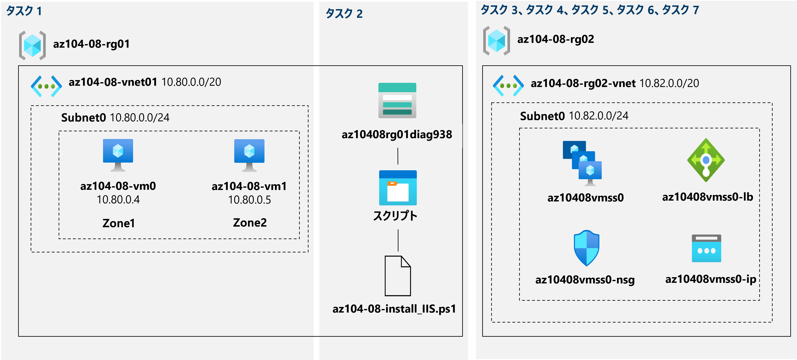

---
lab:
    title: 'ラボ 08 - 仮想マシンを管理する'
    module: 'モジュール 08 - 仮想マシン'
---

# ラボ 08 - 仮想マシンを管理する
# 受講生用ラボ マニュアル

## ラボ シナリオ

Azure 仮想マシンをデプロイおよび構成するためのさまざまなオプションを特定する作業を担当していました。まず、Azure 仮想マシンを使用する場合に実装できるコンピューティングとストレージの復元性とスケーラビリティのオプションを決定する必要があります。次に、Azure 仮想マシン スケール セットを使用する場合に利用可能なコンピューティングとストレージの復元性とスケーラビリティ オプションを調査する必要があります。また、Azure 仮想マシンのカスタム スクリプト拡張機能を使用して、仮想マシンと仮想マシン スケール セットを自動的に構成する機能についても説明します。

## 目標

このラボでは次の内容を学習します。

+ タスク 1: Azure portal と Azure Resource Manager テンプレートを使用して、ゾーン復元可能な Azure 仮想マシンをデプロイする
+ タスク 2: 仮想マシンの拡張機能を使用して、Azure 仮想マシンを構成する
+ タスク 3: Azure 仮想マシンのコンピューティングとストレージをスケーリングする
+ タスク 4: Microsoft.Insights および Microsoft.AlertsManagement リソース プロバイダーを登録する
+ タスク 5: Azure portal を使用してゾーン復元可能な Azure 仮想マシン スケール セットをデプロイする
+ タスク 6: 仮想マシン拡張機能を使用して、Azure 仮想マシン スケール セットを構成する
+ タスク 7: Azure 仮想マシン スケール セット (オプション) のコンピューティングとストレージをスケーリングする

## 推定時間: 50 分

## アーキテクチャの図




## 手順

### 演習 1

#### タスク 1: Azure portal と Azure Resource Manager テンプレートを使用して、ゾーン復元可能な Azure 仮想マシンをデプロイする

このタスクでは、Azure portal と Azure Resource Manager テンプレートを使用して、Azure 仮想マシンをさまざまな可用性ゾーンにデプロイします。

1. [Azure portal](http://portal.azure.com) にサインインします。

1. Azure portal で、「**仮想マシン**」を検索して選択し、「**仮想マシン**」ブレードで、「**+ 作成**」を選択して、「**+ 仮想マシン**」をクリックします。

1. **「仮想マシンの作成」** ブレードの **「基本」** タブで、次の設定を指定します (他の設定は既定値のままにします)。

    | 設定 | 値 |
    | --- | --- |
    | サブスクリプション | このラボで使用する Azure サブスクリプションの名前 |
    | リソース グループ | 新しいリソース グループ **az104-08-rg01** の名前 |
    | 仮想マシン名 | **az104-08-vm0** |
    | リージョン | Availability Zones をサポートし、Azure 仮想マシンをプロビジョニングできるリージョンの 1 つを選択します |
    | 可用性オプション | **可用性ゾーン** |
    | 可用性ゾーン | **1** |
    | イメージ | **Windows Server 2019 Datacenter - Gen1/Gen2** |
    | Azure Spot インスタンス | **いいえ** |
    | サイズ | **スタンダード D2s v3** |
    | ユーザー名 | **受講生** |
    | パスワード | **Pa55w.rd1234** |
    | パブリック受信ポート | **None** |
    | 既存の Windows サーバー ライセンスを使用しますか?  | **いいえ** |

1. 「**次へ: ディスク>**」 をクリックし、「**仮想マシンの作成**」 ブレードの 「**ディスク**」 タブで、次の設定を指定します (他の設定は既定値のままにします)。

    | 設定 | 値 |
    | --- | --- |
    | OS ディスクの種類 | **Premium SSD** |
    | Ultra Disk の互換性を有効にする | **いいえ** |

1. 「**次へ: ネットワーク >**」 をクリックし、「「**仮想マシンの作成**」 ブレードの 「**ネットワーク**」 タブで、「**仮想ネットワーク**」 テキストボックスの下にある 「**新規作成**」 をクリックします。

1. 「**仮想ネットワークの作成**」 ブレードで、次の設定を指定します (他の設定は既定値のままにします)。

    | 設定 | 値 |
    | --- | --- |
    | 名前 | **az104-08-rg01-vnet** |
    | アドレス範囲 | **10.80.0.0/20** |
    | サブネット名 | **subnet0** |
    | サブネット範囲 | **10.80.0.0/24** |

1. 「**OK**」 をクリックし、「**仮想マシンの作成**」 ブレードの 「**ネットワーク**」 タブに戻り、次の設定を指定します (他の設定は既定値のままにします)。

    | 設定 | 値 |
    | --- | --- |
    | サブネット | **subnet0** |
    | パブリック IP | **default** |
    | NIC ネットワーク セキュリティ グループ | **basic** |
    | パブリック受信ポート | **None** |
     | 高速ネットワーク | **Off**
    | この仮想マシンを既存の負荷分散ソリューションの背後に配置しますか?  | **No** |

1. 「**次へ: 管理 >**」 で、「**仮想マシンの作成**」 ブレードの 「**ネットワーク**」 タブで、次の設定を指定します (他は既定値のままにします)。

    | 設定 | 値 |
    | --- | --- |
    | ブート診断 | **Enable with custom storage account (カスタム ストレージ アカウントを使用してブート診断を有効にする)** |
    | 診断ストレージ アカウント | 既定値を受け入れる |
    | パッチ オーケストレーションのオプション | **手動更新** |  

    >**注**: 必要に応じて、ドロップダウン リストで既存のストレージ アカウントを選択します。ストレージ アカウントの名前を記録します。これは、次のタスクで使用します。

1. 「**次へ: 詳細>**」をクリックし、**「仮想マシンの作成」** ブレードの **「詳細」** タブで、利用可能な設定を変更せずに確認し、**「Review + create」** をクリックします。

1. **「Review + create」** ブレードで、**「作成」** をクリックします。

1. 「デプロイ」ブレードで、**「テンプレート」** をクリックします。

1. 進行中のデプロイを表すテンプレートを確認し、**「デプロイ」** をクリックします。

    >**注**: このオプションを使用して、可用性ゾーンを除く、一致する構成を持つ 2 つ目の仮想マシンをデプロイします。

1. **「カスタム デプロイ」** ブレードで、次の設定を指定します (他の設定は既定値のままにします)。

    | 設定 | 値 |
    | --- | --- |
    | ネットワーク インターフェイス名 | **az104-08-vm1-nic1** |
    | パブリック IP アドレス名 | **az104-08-vm1-ip** |
    | 仮想マシン名 | **az104-08-vm1** |
    | 仮想マシンのコンピューター名 | **az104-08-vm1** |
    | 仮想マシン RG | **az104-08-rg01** |    
    | 管理者ユーザー名 | **受講生** |
    | 管理者のパスワード | **Pa55w.rd1234** |
    | ホットパッチの有効化 | **false** |
    | ゾーン | **2** |

    >**注**: 仮想マシンとそのネットワーク インターフェイスを含む、テンプレートを使用して、デプロイしている個別のリソースのプロパティに対応するパラメーターを変更する必要があります。

1. 「**レビューと作成**」 をクリックし、「**レビューと作成**」 ブレードで 「**作成**」 をクリックします。

    >**注**: 次のタスクを進める前に、デプロイが完了するのを待ちます。5 分ほどかかる場合があります。

#### タスク 2: 仮想マシンの拡張機能を使用して、Azure 仮想マシンを構成する

このタスクでは、カスタム スクリプト仮想マシン拡張機能を使用して、前のタスクでデプロイした 2 つのAzure 仮想マシンに Windows Server Web サーバー ロールをインストールします。

1. Azure portal で、「**ストレージ アカウント**」 を検索して選択し、「**ストレージ アカウント**」 ブレードで、前のタスクで作成した診断ストレージ アカウントを表すエントリをクリックします。

1. ストレージ アカウント ブレードの 「**データ ストレージ**」 セクションで、「**コンテナー**」 をクリックしてから、「**+ コンテナー**」 をクリックします。

1. 「**新しいコンテナー**」 ブレードで、次の設定を指定し (他は既定値のままにします) 「**作成**」 をクリックします。

    | 設定 | 値 |
    | --- | --- |
    | 名前 | **scripts** |
    | パブリック アクセス レベル | **非公開 (匿名アクセスなし**) |

1. コンテナーのリストを表示しているストレージ アカウント ブレードに戻り、「**スクリプト**」 をクリックします。

1. 「**スクリプト**」 ブレードで、「**アップロード**」 をクリックします。

1. 「**BLOB のアップロード**」 ブレードでフォルダー アイコンをクリックし、「**開く**」 ダイアログ ボックスで 「**\\Allfiles\\Labs\\08**」 フォルダーに移動して、「**az104-08-install_IIS.ps1**」 を選択します。「**開く**」をクリックし、「**BLOB のアップロード**」 ブレードに戻り、「**アップロード**」 をクリックします。

1. Azure portal で、**仮想マシン**を検索して選択し、「**仮想マシン**」 ブレードで、**az104-08-vm0** を選択します。

1. 「**az104-08-vm0**仮想マシン」ブレードの「**設定**」セクションで「**拡張機能 + アプリケーション**」をクリックしてから、「**+ 追加**」をクリックします。

1. 「**拡張機能のインストール**」ブレードで、「**カスタム スクリプト拡張機能**」をクリックしてから、「**作成**」をクリックします。

1. 「**カスタム スクリプト拡張機能の構成**」ブレードで、「**参照**」をクリックします。

1. 「**ストレージ アカウント**」 ブレードで、**az104-08-install_IIS.ps1** スクリプトをアップロードしたストレージ アカウントの名前をクリックし、「**コンテナー**」 ブレードで 「**スクリプト**」 をクリックし、「**スクリプト**」 ブレードで 「**az104-08-install_IIS.ps1**」 をクリックしてから、「**選択**」 をクリックします。

1. 「**拡張機能のインストール**」ブレードに戻り、「**確認および作成**」をクリックし、「**作成**」をクリックします。

1. Azure portal で、**仮想マシン** を検索して選択し、「**仮想マシン**」 ブレードで、**az104-08-vm1** を選択します 。

1. 「**az104-08-vm1**」 ブレードの 「**Automation**」 セクションで、 「**テンプレートのエクスポート**」 をクリックします。

1. 「**az104-08-vm1 - テンプレートのエクスポート**」 ブレードで、「**デプロイ**」 をクリックします。

1. 「**カスタム デプロイ**」 ブレードで、 「**テンプレートの編集**」 をクリックします。

    >**注**: **リソース グループがテンプレート内の 1 つ以上のリソースでサポートされていない場所にある**というメッセージは無視します。**別のリソース グループを選択してください**。これは正常な動作であり、この場合は無視できます。

1. 「**テンプレートの編集**」 ブレードのテンプレートの内容を表示しているセクションで、**20** 行で始まる次のコードを挿入します (次の行のすぐ下 `"resources": [` line):

   >**注**: intellisense 行ごとにコードを貼り付けるツールを使用している場合は、検証エラーを引き起こす余分な角かっこが追加される可能性があります。コードを最初にメモ帳に貼り付け、次に 20 行目に貼り付けることができます。

   ```json
        {
            "type": "Microsoft.Compute/virtualMachines/extensions",
            "name": "az104-08-vm1/customScriptExtension",
            "apiVersion": "2018-06-01",
            "location": "[resourceGroup().location]",
            "dependsOn": [
                "az104-08-vm1"
            ],
            "properties": {
                "publisher": "Microsoft.Compute",
                "type": "CustomScriptExtension",
                "typeHandlerVersion": "1.7",
                "autoUpgradeMinorVersion": true,
                "settings": {
                    "commandToExecute": "powershell.exe Install-WindowsFeature -name Web-Server -IncludeManagementTools && powershell.exe remove-item 'C:\\inetpub\\wwwroot\\iisstart.htm' && powershell.exe Add-Content -Path 'C:\\inetpub\\wwwroot\\iisstart.htm' -Value $('Hello World from ' + $env:computername)"
              }
            }
        },

   ```

   >**注**: テンプレートのこのセクションでは、Azure PowerShell を使用して最初の仮想マシンに以前デプロイしたのと同じ Azure 仮想マシンのカスタム スクリプト拡張機能を定義します。

1. **「保存」** をクリックし、**「カスタム テンプレート」** ブレードの **「確認および作成** をクリックし、**「確認および作成」** ブレードで **「作成」** をクリックします

    >**注**: テンプレート デプロイが完了するのを待ちます。その進行状況は、**a104-08-vm0** の「**拡張機能**」ブレードおよび **az104-08-vm1** 仮想マシンから監視できます。これは 3 分もかかりません。

1. カスタム スクリプト拡張ベースの構成が正常に実行されたことを確認するには、「**az104-08-vm1**」ブレードに戻り、「**操作**」セクションの「**コマンドの実行**」をクリックし、コマンドの一覧で「**RunPowerShellScript**」をクリックします。

1. 「**コマンド スクリプトの実行**」ブレードで 次のコマンドを入力し、「**実行**」をクリックして **az104-08-vm0** でホストされている Web サイトにアクセスします。

   ```powershell
   Invoke-WebRequest -URI http://10.80.0.4 -UseBasicParsing
   ```

    >**注**: コマンドレットの実行を完了するために Internet Explorer への依存関係を排除するには、**-UseBasicParsing** パラメーターが必要です。

    >**注**: **az104-08-vm0** に接続 し、`Invoke-WebRequest -URI http://10.80.0.5 -UseBasicParsing` を実行して、**az104-08-vm1** でホストされている Web サイトにアクセスすることもできます。

#### タスク 3: Azure 仮想マシンのコンピューティングとストレージをスケーリングする

このタスクでは、サイズを変更して Azure 仮想マシンのコンピューティングをスケーリングし、データ ディスクを接続して構成することでストレージをスケーリングします。

1. Azure portal で、**仮想マシン**を検索して選択し、「**仮想マシン**」 ブレードで、**az104-08-vm0** を選択します。

1. **Az104-08-vm0** 仮想マシン ブレードで、「**サイズ**」 をクリックし、仮想マシンのサイズを **Standard DS1_v2** に設定し、「**サイズ変更**」 をクリックします。

    >**注**: **Standard DS1_v2** がない場合は、別のサイズを選択します。

1. 「**az104-08-vm0** 仮想マシン」 ブレードで、「**ディスク**」 をクリックし、「**データ ディスク**」 の下の、「**+ 新しいディスクを作成して接続する**」 をクリックします。

1. 次の設定でマネージド ディスクを作成します (他は既定値のままにします):

    | 設定 | 値 |
    | --- | --- |
    | ディスク名 | **az104-08-vm0-datadisk-0** |
    | ストレージの種類 | **Premium SSD** |
    | サイズ (GiB| **1024** |

1. 「**az104-08-vm0 - ディスク**」 ブレードに戻り、「**データ ディスク**」 の 「**+ 新しいディスクを作成して接続する**」 をクリックします。

1. 次の設定でマネージド ディスクを作成し (他は既定値のままにします)、変更を保存します:

    | 設定 | 値 |
    | --- | --- |
    | ディスク名 | **az104-08-vm0-datadisk-1** |
    | ストレージの種類 | **Premium SSD** |
    | サイズ (GiB)| **1024 GiB** |

1. 「**az104-08-vm0 - ディスク**」 ブレードに戻り 、「**保存**」 をクリックします。

1. 「**az104-08-vm0**」 ブレードの 「**操作**」 セクションで、 「**コマンドの実行**」 をクリックし、コマンドのリストで **RunPowerShellScript** を選択します。

1. 「**コマンド スクリプトの実行**」 ブレードで、次のように入力し、「**実行**」 をクリックして、単純なレイアウトと固定プロビジョニングを備えた 2 つの新しく接続されたディスクで構成されるドライブ Z を作成します。

   ```powershell
   New-StoragePool -FriendlyName storagepool1 -StorageSubsystemFriendlyName "Windows Storage*" -PhysicalDisks (Get-PhysicalDisk -CanPool $true)

   New-VirtualDisk -StoragePoolFriendlyName storagepool1 -FriendlyName virtualdisk1 -Size 2046GB -ResiliencySettingName Simple -ProvisioningType Fixed

   Initialize-Disk -VirtualDisk (Get-VirtualDisk -FriendlyName virtualdisk1)

   New-Partition -DiskNumber 4 -UseMaximumSize -DriveLetter Z
   ```

    > **注**: コマンドが正常に完了したことの確認を待ちます。

1. Azure portal で、**仮想マシン** を検索して選択し、「**仮想マシン**」 ブレードで、**az104-08-vm1** を選択します 。

1. 「**az104-08-vm1**」 ブレードの 「**Automation**」 セクションで、「**テンプレートのエクスポート**」 をクリックします。

1. 「**az104-08-vm1 - テンプレートのエクスポート**」 ブレードで、「**デプロイ**」 をクリックします。

1. 「**カスタム デプロイ**」 ブレードで、 「**テンプレートの編集**」 をクリックします。

    >**注**: **リソース グループがテンプレート内の 1 つ以上のリソースでサポートされていない場所にある**というメッセージは無視します。**別のリソース グループを選択してください**。これは正常な動作であり、この場合は無視できます。

1. 「**テンプレートの編集**」 ブレードの「テンプレートの内容を表示する」セクションで、行 **30** `"vmSize": "Standard_D2s_v3"`を次の行に置き換えます)。

   ```json
                    "vmSize": "Standard_DS1_v2"

   ```

    >**注**: テンプレートのこのセクションでは、Azure portal を介して最初の仮想マシンに指定したものと同じ Azure 仮想マシンのサイズを定義します。

1. 「**テンプレートの編集**」 ブレードの「テンプレートの内容を表示する」セクションで、行 **50** `"dataDisks": [ ]` line) を次のコードに置き換えます。

   ```json
                    "dataDisks": [
                      {
                        "lun": 0,
                        "name": "az104-08-vm1-datadisk0",
                        "diskSizeGB": "1024",
                        "caching": "ReadOnly",
                        "createOption": "Empty"
                      },
                      {
                        "lun": 1,
                        "name": "az104-08-vm1-datadisk1",
                        "diskSizeGB": "1024",
                        "caching": "ReadOnly",
                        "createOption": "Empty"
                      }
                    ]
   ```

    >**注**: intellisense 行ごとにコードを貼り付けるツールを使用している場合は、検証エラーを引き起こす余分な角かっこが追加される可能性があります。コードを最初にメモ帳に貼り付け、次に 49 行目に貼り付けることができます。

    >**注**: テンプレートのこのセクションでは、Azure portal を介して最初の仮想マシンのストレージ構成と同様に、2 つのマネージド ディスクを作成し、**az104-08-vm1** に接続します。


1. 「**保存**」をクリックし、「**カスタム デプロイ**」ブレードの「**確認および作成**をクリックし、「**確認および作成**」ブレードで「**作成**」をクリックします

    >**注**: テンプレート デプロイが完了するのを待ちます。**az104-08-vm1**仮想マシンの 「**ディスク**」 ブレードから進行状況を監視できます。これは 3 分もかかりません。

1. 「**az104-08-vm1**」 ブレードに戻り、「**操作**」 セクションの 「**コマンドの実行**」 をクリックし、コマンドのリストで 「**RunPowerShellScript**」 をクリックします。

1. 「**コマンド スクリプトの実行**」 ブレードで、次のように入力し、「**実行**」 をクリックして、単純なレイアウトと固定プロビジョニングを備えた 2 つの新しく接続されたディスクで構成されるドライブ Z を作成します。

   ```powershell
   New-StoragePool -FriendlyName storagepool1 -StorageSubsystemFriendlyName "Windows Storage*" -PhysicalDisks (Get-PhysicalDisk -CanPool $true)

   New-VirtualDisk -StoragePoolFriendlyName storagepool1 -FriendlyName virtualdisk1 -Size 2046GB -ResiliencySettingName Simple -ProvisioningType Fixed

   Initialize-Disk -VirtualDisk (Get-VirtualDisk -FriendlyName virtualdisk1)

   New-Partition -DiskNumber 4 -UseMaximumSize -DriveLetter Z
   ```

    > **注**: コマンドが正常に完了したことの確認を待ちます。

#### タスク 4: Microsoft.Insights および Microsoft.AlertsManagement リソース プロバイダーを登録する

1. Azure portal の右上にあるアイコンをクリックして **Azure Cloud Shell** を開きます。

1. **Bash** や **PowerShell** のどちらかを選択するためのプロンプトが表示されたら、**PowerShell** を選択します。

    >**注**: **Cloud Shell** の初回起動時に 「**ストレージがマウントされていません**」 というメッセージが表示された場合は、このラボで使用しているサブスクリプションを選択し、「**ストレージの作成**」 を選択します。

1. 「Cloud Shell」ウィンドウから、次のコマンドを実行して、Microsoft.Insights および Microsoft.AlertsManagement リソース プロバイダーを登録します。

   ```powershell
   Register-AzResourceProvider -ProviderNamespace Microsoft.Insights

   Register-AzResourceProvider -ProviderNamespace Microsoft.AlertsManagement
   ```

#### タスク 5: Azure portal を使用してゾーン復元可能な Azure 仮想マシン スケール セットをデプロイする

このタスクでは、Azure portal を使用して、可用性ゾーン間で Azure 仮想マシン スケール セットをデプロイします。

1. Azure portal で、**「仮想マシン スケール セット」** を検索して選択し、**「仮想マシン スケール セット」** ブレードで、**「+ 追加」** (または **+ 作成**) をクリックします。

1. 「**仮想マシン スケール セットの作成**」 ブレードの 「**基本**」 タブで、次の設定を指定し (他の設定は既定値のままにします)、「**次へ: ディスク >**」 をクリックします。

    | 設定 | 値 |
    | --- | --- |
    | サブスクリプション | このラボで使用する Azure サブスクリプションの名前 |
    | リソース グループ | 新しいリソース グループ **az104-08-rg02** の名前 |
    | 仮想マシン スケール セットの名前 | **az10408vmss0** |
    | リージョン | 可用性ゾーンをサポートするリージョンの 1 つを選択し、このラボで前に仮想マシンをデプロイするために使用したものとは異なる Azure 仮想マシンをプロビジョニングできる場所を選択します |
    | 可用性ゾーン | **ゾーン 1、 2、 3** |
    | イメージ | **Windows Server 2019 Datacenter - Gen2** |
    | Azure Spot インスタンス | **いいえ** |
    | サイズ | **Standard D2s_v3** |
    | ユーザー名 | **受講生** |
    | パスワード | **Pa55w.rd1234** |
    | すでに Windows サーバーのライセンスを持っていますか?  | **いいえ** |

    >**注**: Windows 仮想マシンの可用性ゾーンへのデプロイをサポートする Azure リージョンのリストについては、「[Azure のAvailability Zonesとは](https://docs.microsoft.com/ja-jp/azure/availability-zones/az-overview)」を参照してください。

1. 「**仮想マシン スケール セットの作成**」 ブレードの 「**ディスク**」 タブで、既定値を受け入れて 「**次へ: ネットワーク >**」 をクリックします。

1. 「**仮想マシン スケール セットの作成**」 ブレードの 「**ネットワーク**」 タブで、 「**仮想ネットワーク**」 テキスト ボックスの下にある 「**仮想ネットワークの作成**」 リンクをクリックし、次の設定で新しい仮想ネットワークを作成します (他は既定値のままにします)。

    | 設定 | 値 |
    | --- | --- |
    | 名前 | **az104-08-rg02-vnet** |
    | アドレス範囲 | **10.82.0.0/20** |
    | サブネット名 | **subnet0** |
    | サブネット範囲 | **10.82.0.0/24** |

    >**注**: 新しい仮想ネットワークを作成し、「**仮想マシン スケール セットの作成**」 ブレードの 「**ネットワーク**」 タブに戻ると、「**仮想ネットワーク**」 の値が自動的に **az104-08-rg02-vnet** に設定されます。

1. 「**仮想マシン スケール セットの作成**」 ブレードの 「**ネットワーク**」 タブに戻り、ネットワーク インターフェイス エントリの右側にある 「**ネットワーク インターフェイスの編集**」 アイコンをクリックします。

1. 「**ネットワーク インターフェイスの編集**」 ブレードの 「**NIC ネットワーク セキュリティ グループ**」 セクションで、「**詳細**」 をクリックし、「**ネットワーク セキュリティグループの構成**」 ドロップダウン リストの 「**新規作成**」 をクリックします。

1. 「**ネットワーク セキュリティ グループの作成**」 ブレードで、次の設定を指定します (他の設定は既定値のままにします)。

    | 設定 | 値 |
    | --- | --- |
    | 名前 | **az10408vmss0-nsg** |

1. 「**受信規則の追加**」 をクリックし、次の設定を使用して受信セキュリティ規則を追加します (他の設定は既定値のままにします)。

    | 設定 | 値 |
    | --- | --- |
    | ソース | **Any** |
    | ソース ポート範囲 | **\*** |
    | 宛先 | **Any** |
    | 宛先ポート範囲 | **80** |
    | プロトコル | **TCP** |
    | アクション | **Allow** |
    | 優先度 | **1010** |
    | 名前 | **custom-allow-http** |

1. 「**追加**」 をクリックし、「**ネットワーク セキュリティ グループの作成**」 ブレードに戻って、「**OK**」 をクリックします。

1. 「**ネットワーク インターフェイスの編集**」 ブレードに戻り、「**パブリック IP アドレス**」 セクションで 「**有効**」 をクリックし、「**OK**」 をクリックします。

1. 「**仮想マシンスケールセットの作成**」 ブレードの 「**ネットワーク**」 タブに戻り、「**負荷分散**」 セクションで、「**ロード バランサーを使用する**」 エントリが選択されていることを確認し、次の**負荷分散設定**を指定して (他の設定はデフォルト値のままにします)、「**次へ: スケーリング >**」 をクリックします。

    | 設定 | 値 |
    | --- | --- |
    | 負荷分散オプション | **Azure Load Balancer** |
    | ロード バランサーを選択する | **(new) az10408vmss0-lb** |
    | バックエンド プールを選択する | **(new) bepool** |

1. 「**仮想マシン スケール セットの作成**」 ブレードの 「**スケーリング**」 タブで、次の設定を指定し (他の設定は既定値のままにします)、 「**次へ: 管理 >**」 をクリックします。

    | 設定 | 値 |
    | --- | --- |
    | 初期インスタンス数 | **2** |
    | スケーリング ポリシー | **Manual** |

1. 「**仮想マシン スケール セットの作成**」ブレードの「**管理**」タブで、次の設定を指定します (他の設定は既定値のままにします)。

    | 設定 | 値 |
    | --- | --- |
    | ブート診断 | **Enable with custom storage account (カスタム ストレージ アカウントを使用してブート診断を有効にする)** |
    | 診断ストレージ アカウント | 既定値を受け入れる |

    >**注**: 次のタスクでは、このストレージ アカウントの名前が必要になります。

   「**次へ : 正常性 >**」 をクリックします。

1. 「**仮想マシン スケール セットの作成**」 ブレードの 「**正常性**」 タブで、変更を加えずに既定の設定を確認し、 「**次へ: 詳細 >**」 をクリックします。

1. 「**仮想マシン スケール セットの作成**」 ブレードの 「**詳細**」 タブで、次の設定を指定し (他の設定は既定値のままにします)、 「**レビューと作成**」 をクリックします。

    | 設定 | 値 |
    | --- | --- |
    | 拡散アルゴリズム | **Fixed spreading (固定拡散) (ゾーンでは推奨されません)** |

    >**注**: 「**最大拡散**」 設定は現在機能していません。

1. 「**仮想マシン スケール セットの作成**」 ブレードの 「**レビューと作成**」 タブで、検証が成功したことを確認し、「**作成**」 をクリックします。

    >**注**: 仮想マシン スケール セットのデプロイが完了するのを待ちます。通常は 5 分ほどかかります。

#### タスク 6: 仮想マシン拡張機能を使用して、Azure 仮想マシン スケール セットを構成する

このタスクでは、カスタム スクリプト仮想マシン拡張機能を使用して、前のタスクでデプロイした Azure 仮想マシン スケール セットのインスタンスに Windows Server Web サーバー ロールをインストールします。

1. Azure portal で、「**ストレージ アカウント**」 を検索して選択し、「**ストレージ アカウント**」 ブレードで、前のタスクで作成した診断ストレージ アカウントを表すエントリをクリックします。

1. ストレージ アカウント ブレードの 「**データ ストレージ**」 セクションで、「**コンテナー**」 をクリックしてから、「**+ コンテナー**」 をクリックします。

1. 「**新しいコンテナー**」 ブレードで、次の設定を指定し (他は既定値のままにします) 「**作成**」 をクリックします。

    | 設定 | 値 |
    | --- | --- |
    | 名前 | **scripts** |
    | パブリック アクセス レベル | **非公開 (匿名アクセスなし**) |

1. コンテナーのリストを表示しているストレージ アカウント ブレードに戻り、「**スクリプト**」 をクリックします。

1. 「**スクリプト**」 ブレードで、「**アップロード**」 をクリックします。

1. 「**BLOB のアップロード**」 ブレードでフォルダー アイコンをクリックし、「**開く**」 ダイアログ ボックスで 「**\\Allfiles\\Labs\\08**」 フォルダーに移動して、「**az104-08-install_IIS.ps1**」 を選択します。 「**開く**」 をクリックし、「**BLOB のアップロード**」 ブレードに戻り、「**アップロード**」 をクリックします。

1. Azure portal で、「**仮想マシン スケールセット**」 ブレードに戻り、「**az10408vmss0**」 をクリックします。

1. 「**z10408vmss0**」 ブレードの 「**設定**」 セクションで、「**拡張機能**」 をクリックし、「**+ 追加**」 をクリックします。

1. 「**新しいリソース**」 ブレードで、「**カスタム スクリプト拡張機能**」 をクリックしてから、「**作成**」 をクリックします。

1. 「**拡張機能のインストール**」ブレードで、このタスクの前半で、ストレージ アカウントの**スクリプト** コンテナーにアップロードした **az104-08-install_IIS.ps1** スクリプトを**参照**して**選択**してから、「**作成**」をクリックします。

    >**注**: 拡張機能のインストールが完了するのを待ってから、次の手順に進みます。

1. 「**az10408vmss0**」 ブレードの 「**設定**」 セクションで、「**インスタンス**」 をクリックし、仮想マシン スケール セットの 2 つのインスタンスの横にあるチェックボックスをオンにして、「**アップグレード**」 をクリックして、確認を求められたら、「**はい**」 をクリックします。

    >**注**: アップグレードが完了するのを待ってから、次の手順に進みます。

1. Azure portal で 「**負荷分散装置**」 を検索して選択し、負荷分散装置のリストで 「**az10408vmss0-lb**」 をクリックします。

1. 「**az10408vmss0-lb**」 ブレードで、負荷分散装置のフロントエンドに割り当てられた 「**パブリック IP アドレス**」 の値をメモし、新しいブラウザー タブを開いて、その IP アドレスに移動します。

    >**注**: ブラウザー ページに、Azure 仮想マシン スケール セット 「**az10408vmss0**」 のいずれかのインスタンスの名前が表示されることを確認します。

#### タスク 7: Azure 仮想マシン スケール セットのコンピューティングとストレージをスケーリングする

このタスクでは、仮想マシン スケール セット インスタンスのサイズを変更し、それらの自動スケーリング設定を構成して、ディスクを接続します。

1. Azure portal で、**仮想マシン Scale Sets**を検索して選択し、**「az10408vmss0」** スケール セットを選択します。

1. 「**az10408vmss0**」ブレードの「**設定**」セクションで、「**サイズ**」をクリックします。

1. 使用可能なサイズのリストで、「**標準 DS1_v2**」 を選択し、「**サイズ変更**」 をクリックします。

1. 「**設定**」 セクションで、「**インスタンス**」 をクリックし、仮想マシン スケール セットの 2 つのインスタンスの横にあるチェックボックスをオンにします。「**アップグレード**」 をクリックし、確認を求められたら、「**はい**」 をクリックします。

1. インスタンスのリストで、最初のインスタンスを表すエントリをクリックし、スケール セット インスタンス ブレードで、その**場所** (Azure 仮想マシン スケール セットをデプロイしたターゲット Azure リージョン内のゾーンの 1 つである必要があります) をメモします。

1. 「**az10408vmss0 - インスタンス**」ブレードに戻り、2 番目のインスタンスを表すエントリをクリックし、スケール セット インスタンス ブレードで、その**場所** (Azure 仮想マシン スケール セットをデプロイしたターゲット Azure リージョン内の他の 2 つのゾーンの 1 つである必要があります) をメモします。

1. 「**az10408vmss0 - インスタンス**」 ブレードに戻り、「**設定**」 セクションで 「**設定**」 をクリックします。

1. 「**az10408vmss0 - スケーリング**」 ブレードで、「**カスタム自動スケール**」 オプションを選択し、次の設定で自動スケーリングを構成します (他の設定は既定値のままにします)。

    | 設定 | 値 |
    | --- |--- |
    | スケーリング モード | **Scale based on a metric (メトリックに基づくスケール)** |

1. 「**+ ルールの追加**」 リンクをクリックし、「**スケール ルール**」 ブレードで次の設定を指定します (他の設定は既定値のままにします)。

    | 設定 | 値 |
    | --- |--- |
    | メトリックのソース | **現在のリソース (az10480vmss0)** |
    | 時間の集計 | **Average** |
    | メトリック名前空間 | **仮想マシン Host** |
    | メトリック名 | **Network In Total** |
    | 演算子 | **Greater than** |
    | スケール アクションをトリガーするメトリックのしきい値 | **10** |
    | 時間 (分単位) | **1** |
    | 統計時間単位 | **Average** |
    | 操作 | **Increase count by** |
    | インスタンス数 | **1** |
    | クールダウン (分) | **5** |

    >**注**: これらの値は、待機時間を延長せずにできるだけ早く自動スケールをトリガーすることを目的としているため、現実的な構成ではありません。

1. 「**追加**」 をクリックし、「**az10408vmss0 - スケーリング**」 ブレードに戻って、次の設定を指定します (他の設定は既定値のままにします)。

    | 設定 | 値 |
    | --- |--- |
    | インスタンス制限最小 | **1** |
    | インスタンス制限最大 | **3** |
    | インスタンス制限既定値 | **1** |

1. 「**保存**」をクリックします。

1. Azure portal の右上にあるアイコンをクリックして **Azure Cloud Shell** を開きます。

1. **Bash** や **PowerShell** のどちらかを選択するためのプロンプトが表示されたら、**PowerShell** を選択します。

1. 「Cloud Shell」 ウィンドウから次のコマンドを実行して、Azure 仮想マシン スケール セット **az10408vmss0** の前にあるロード バランサーのパブリック IP アドレスを特定します。

   ```powershell
   $rgName = 'az104-08-rg02'

   $lbpipName = 'az10408vmss0-ip'

   $pip = (Get-AzPublicIpAddress -ResourceGroupName $rgName -Name $lbpipName).IpAddress
   ```

1. 「Cloud Shell」 ウィンドウから、Azure 仮想マシン スケール セット **az10408vms0** のインスタンスでホストされている Web サイトに HTTP 要求を送信する開始ループと無限ループを次のように実行します。

   ```powershell
   while ($true) { Invoke-WebRequest -Uri "http://$pip" }
   ```

1. 「Cloud Shell」ウィンドウを最小化しますが、閉じるのではなく、「**az10408vms0 - インスタンス**」 ブレードに戻り、インスタンス数を監視します。

    >**注**: 数分待ってから 「**更新**」 をクリックする必要がある場合があります。

1. 3 番目のインスタンスがプロビジョニングされたら、そのブレードに移動して、その**場所**を確認します (このタスクで先ほど指定した最初の 2 つのゾーンとは異なる必要があります)。

1. 「Cloud Shell」ウィンドウを閉じます。

1. 「**az10408vmss0**」 ブレードの 「**設定**」 セクションで、「**ディスク**」 をクリックし、「**+ 新しいディスクの作成と接続**」 をクリックして、次の設定で新しいマネージド ディスクを接続します (他の設定は既定値のままにします)。

    | 設定 | 値 |
    | --- | --- |
    | LUN | **0** |
    | ストレージの種類 | **標準 HDD** |
    | サイズ (GiB) | **32** |

1. 変更を保存して、「**az10408vms0**」 ブレードの 「**設定**」 セクションで 「**インスタンス**」 をクリックし、仮想マシン スケール セットの 2 のインスタンスの横にあるチェックボックスをオンにし、「**アップグレード**」 をクリックして、確認を求められたら、「**はい**」 を選択します。

    >**注**: 前の手順で接続されたディスクは未フォーマット ディスクです。使用する前に、パーティションを作成して、ファイルシステムを作成し、マウントする必要があります。これを実現するには、Azure 仮想マシンのカスタム スクリプト拡張機能を使用します。まず、既存のカスタム スクリプト拡張機能を削除する必要があります。

1. 「**az10408vmss0**」 ブレードの 「**設定**」 セクションで、「**拡張機能**」 をクリックし、「**CustomScriptExtension**」 をクリックし、「**アンインストール**」 をクリックします。

    >**注**: アンインストールが完了するまで待機します。

1. Azure portal の右上にあるアイコンをクリックして **Azure Cloud Shell** を開きます。

1. **Bash** や **PowerShell** のどちらかを選択するためのプロンプトが表示されたら、**PowerShell** を選択します。

1. 「Cloud Shell」ウィンドウのツールバーで、 「**ファイルのアップロード/ダウンロード**」 アイコンを選択し、ドロップダウン メニューで 「**アップロード**」 を選択して、ファイル **\\Allfiles\\Labs\\08\\az104-08-configure_VMSS_disks.ps1** を Cloud Shell ホーム ディレクトリにアップロードします。

1. 「Cloud Shell」ウィンドウから、次のコマンドを実行してスクリプトのコンテンツを表示します。

   ```powershell
   Set-Location -Path $HOME

   Get-Content -Path ./az104-08-configure_VMSS_disks.ps1
   ```

    >**注**: このスクリプトは、接続されたディスクを構成するカスタム スクリプト拡張機能をインストールします。

1. 「Cloud Shell」ウィンドウで、次を実行してスクリプトを実行し、Azure 仮想マシン スケール セットのディスクを構成します。

   ```powershell
   ./az104-08-configure_VMSS_disks.ps1
   ```

1. 「Cloud Shell」 ペインを閉じます。

1. **「az10408vmss0」** ブレードの **「設定」** セクションで、**「インスタンス」** をクリックし、仮想マシン スケール セットの 2 のインスタンスの横にあるチェックボックスをオンにして、**「アップグレード」** をクリックして、確認を求められたら、**「はい」** をクリックします。

#### リソースをクリーン アップする

   >**注**: 新しく作成した Azure リソースのうち、使用しないリソースは必ず削除してください。使用しないリソースを削除し、予期しないコストが発生しないようにします。

1. Azure portal の 「**Cloud Shell**」 ウィンドウで 「**PowerShell**」 セッションを開きます。

1. 次のコマンドを実行して az104-08-configure_VMSS_disks.ps1 を削除します。

   ```powershell
   rm ~\az104-08*
   ```

1. 次のコマンドを実行して、このモジュールのラボ全体で作成したすべてのリソース グループのリストを表示します。

   ```powershell
   Get-AzResourceGroup -Name 'az104-08*'
   ```

1. 次のコマンドを実行して、このモジュールのラボ全体で作成したすべてのリソース グループのリストを削除します。

   ```powershell
   Get-AzResourceGroup -Name 'az104-08*' | Remove-AzResourceGroup -Force -AsJob
   ```

    >**注**: コマンドは非同期で実行されるので (-AsJob パラメーターによって決定されます)、別の PowerShell コマンドを同一 PowerShell セッション内ですぐに実行できますが、リソース グループが実際に削除されるまでに数分かかります。

#### 確認

このラボでは次の内容を学習しました。

+ Azure Portal と Azure Resource Manager テンプレートを使用して、ゾーン復元可能な Azure 仮想マシンをデプロイしました
+ 仮想マシンの拡張機能を使用して、Azure 仮想マシンを構成しました
+ Azure 仮想マシンのコンピューティングとストレージをスケーリングしました
+ Azure portal を使用して、ゾーン復元力のある Azure 仮想マシン スケール セットをデプロイしました
+ 仮想マシン拡張機能を使用して、Azure 仮想マシン スケール セットを構成しました
+ Azure 仮想マシン スケール セットのコンピューティングとストレージをスケーリングしました
