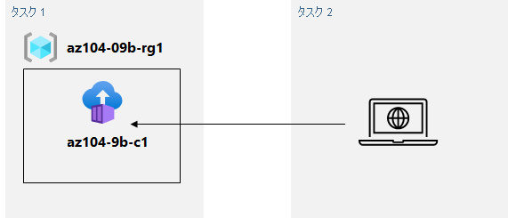

---
lab:
    title: '09b - Azure Container Instancesの実装'
    module: 'モジュール 09 - サーバーレス コンピューティング'
---

# ラボ 09b - Azure Container Instancesの実装
# 学生用ラボ マニュアル

## ラボ シナリオ

Contoso は、仮想化されたワークロード用の新しいプラットフォームを見つけることを目的としています。この目的を達成するために使用できるコンテナー イメージの数を特定しました。コンテナー管理を最小限に抑えるため、Docker イメージのデプロイに Azure Container Instances の使用を評価する予定です。

## 目標

このラボでは次の内容を学習します。

- タスク 1: Azure Container Instance を使用して Docker イメージをデプロイする
- タスク 2: Azure Container Instances の機能を確認する

## 予想時間: 20 分

## アーキテクチャの図



## 指示

### 演習 1

#### タスク 1: Azure Container Instance を使用して Docker イメージをデプロイする

このタスクでは、Web アプリケーションの新しいコンテナー インスタンスを作成します。

1. [Azure portal](https://portal.azure.com) にサインインします。

1. Azure portal で **「コンテナー インスタンス」** を検索し、**「コンテナー インスタンス」** ブレードで **「+ 作成」** をクリックします。

1. **「コンテナー インスタンスの作成」** ブレードの **「基本」** タブで、次の設定を指定します (他の設定は既定値のままにします)。

    | 設定 | 値 |
    | ---- | ---- |
    | サブスクリプション | このラボで使用する Azure サブスクリプションの名前 |
    | リソース グループ | 新しいリソース グループ **az104-09b-rg1** の名前 |
    | コンテナー名 | **az104-9b-c1** |
    | リージョン | （US）米国東部 |
    | イメージのソース | **クイック スタート イメージ** |
    | イメージ | **mcr.microsoft.com/azuredocs/aci-helloworld:latest (Linux)** |

1. **「次: ネットワーク >」** をクリックし、**「コンテナー インスタンスの作成」** ブレードの **「ネットワーク」** タブで、次の設定を指定します (他の設定は既定値のままにします)。

    | 設定 | 値 |
    | --- | --- |
    | DNS 名ラベル | 有効でグローバルに一意の DNS ホスト名 |

    > **注**: コンテナーは、dns-name-label.region.azurecontainer.io でパブリックにアクセスできるようになります。**「DNS 名ラベルは使用できません」** というエラー メッセージを受け取った場合は、別の DNS 名ラベルを指定します。

1. **「次: 詳細 >」** をクリックし、**「コンテナー インスタンスの作成」** ブレードの **「詳細」** タブで、何も変更せずに設定を確認し、**「確認および作成」** をクリックし、検証が成功したことを確認して、**「作成」** をクリックします。

    >**注**: デプロイが完了するのを待ちます。これにはおよそ 3 分かかります。

    >**注**: 待っているあいだに、この[サンプル アプリケーションに隠れたコード](https://github.com/Azure-Samples/aci-helloworld)を見ることに興味を持つかもしれません。それを参照するには、\app フォルダーを開きます。

#### タスク 2: Azure Container Instances の機能を確認する

このタスクでは、コンテナー インスタンスのデプロイを確認します。

1. デプロイ ブレードで、**「リソースに移動」** リンクをクリックします。

1. コンテナー インスタンスの **「概要」** ブレードで、**「状態」** が **「実行中」** と表示されていることを確認します。

1. コンテナー インスタンスの **FQDN** の値をコピーし、新しいブラウザー タブを開き、対応する URL に移動します。

1. **「Welcome to Azure Container Instances!」** ページが表示されていることを確認します。

1. 新しいブラウザー タブを閉じ、Azure portal に戻り、コンテナー インスタンス ブレードの **「設定」** セクションで **「コンテナー」** をクリックし、**「ログ」** をクリックします。

1. ブラウザーでアプリケーションを表示すると生成される HTTP GET 要求のログを確認します。

#### リソースをクリーン アップする

   >**注**: 新しく作成した Azure リソースのうち、使用しないリソースは必ず削除してください。使用しないリソースを削除しないと、予期しないコストが発生する場合があります。

1. Azure portal の **「Cloud Shell」** ウィンドウで **「PowerShell」** セッションを開きます。

1. 次のコマンドを実行して、このモジュールのラボ全体で作成したすべてのリソース グループのリストを表示します。

   ```powershell
   Get-AzResourceGroup -Name 'az104-09b*'
   ```

1. 次のコマンドを実行して、このモジュールのラボ全体で作成したすべてのリソース グループのリストを削除します。

   ```powershell
   Get-AzResourceGroup -Name 'az104-09b*' | Remove-AzResourceGroup -Force -AsJob
   ```

    >**注**: コマンドは非同期で実行されるので (-AsJob パラメーターによって決定されます)、別の PowerShell コマンドを同一 PowerShell セッション内ですぐに実行できますが、リソース グループが実際に削除されるまでに数分かかります。

#### レビュー

このラボでは次の内容を学習しました。

- Azure コンテナー インスタンス を使って Docker イメージ をデプロイしました
- Azure コンテナー インスタンスの機能をレビュー確認しました
