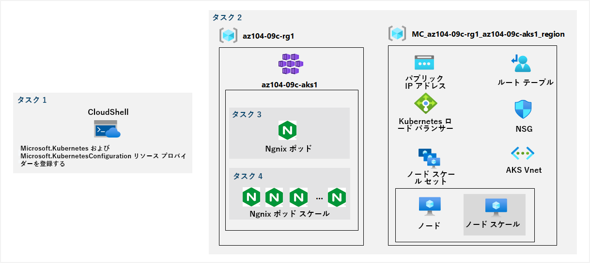

---
lab:
    title: '09c - Azure Kubernetes Service を実装する'
    module: 'モジュール 09 - サーバーレス コンピューティング'
---

# ラボ 09c - Azure Kubernetes Service を実装する
# 学生用ラボ マニュアル

## ラボ シナリオ

Contoso には、Azure Container Instances を使用して実行するのに適していない多層アプリケーションが多数あります。コンテナー化されたワークロードとして実行できるかどうかを判断するには、Kubernetes をコンテナー オーケストレーターとして使用して評価します。管理オーバーヘッドをさらに最小限に抑えるには、簡単なデプロイ エクスペリエンスやスケーリング機能などを含めた Azure Kubernetes Service をテストします。

## 目標

このラボでは次の内容を学習します。

+ タスク 1: Microsoft.Kubernetes および Microsoft.KubernetesConfiguration リソース プロバイダーを登録します。
+ タスク 2: Azure Kubernetes Service クラスターをデプロイする
+ タスク 3: Azure Kubernetes Service クラスターにポッドをデプロイする
+ タスク 4: Azure Kubernetes Service クラスターでコンテナー化されたワークロードをスケーリングする

## 予想時間: 40 分

## アーキテクチャの図



## 手順

### 演習 1

#### タスク 1: Microsoft.Kubernetes および Microsoft.KubernetesConfiguration リソース プロバイダーを登録します。

このタスクでは、Azure Kubernetes Service クラスターをデプロイするために必要なリソース プロバイダーを登録します。

1. [Azure portal](https://portal.azure.com) にサインインします。

1. Azure portal の右上にあるアイコンをクリックして **Azure Cloud Shell** を開きます。

1. **Bash** や **PowerShell** のどちらかを選択するためのプロンプトが表示されたら、**PowerShell** を選択します。

    >**注**: **Cloud Shell** の初回起動時に **「ストレージがマウントされていません」** というメッセージが表示された場合は、このラボで使用しているサブスクリプションを選択し、**「ストレージの作成」** を選択します。

1. 「Cloud Shell」 ウィンドウから、次のコマンドを実行して、Microsoft.Kubernetes および Microsoft.KubernetesConfiguration リソース プロバイダーを登録します。

   ```powershell
   Register-AzResourceProvider -ProviderNamespace Microsoft.Kubernetes

   Register-AzResourceProvider -ProviderNamespace Microsoft.KubernetesConfiguration
   ```

1. 「Cloud Shell」 ウィンドウを閉じます。

#### タスク 2: Azure Kubernetes Service クラスターをデプロイする

このタスクでは、Azure portal を使用して Azure Kubernetes Service クラスターをデプロイします。

1. Azure portal で、「**Kubernetes サービス**」を検索してから、「**Kubernetes サービス**」ブレードで「**+ 作成**」をクリックし、「**+ Kubernetes クラスターの作成**」をクリックします。

1. **「Kubernetes クラスターの作成」** ブレードの **「基本」** タブで、次の設定を指定します (他の設定は既定値のままにします)。

    | 設定 | 値 |
    | ---- | ---- |
    | サブスクリプション | このラボで使用する Azure サブスクリプションの名前 |
    | リソース グループ | 新しいリソース グループ **az104-09c-rg1** の名前 |
    | Kubernetes クラスターの名前 | **az104-9c-aks1** |
    | リージョン | （US）米国東部 |
    | 可用性ゾーン | **なし** (すべてのチェックボックスをオフにする) |
    | Kubernetes バージョン | 既定値を受け入れる |
    | ノードのサイズ | 既定値を受け入れる |
    | ノード数 | **1** |

1. **「次: ノード プール >」** をクリックし 「**Kubernetes クラスターの作成**」 ブレードの 「**ノード プール**」 タブで、次の設定を指定します (他の設定は既定値のままにします)。

    | 設定 | 値 |
    | ---- | ---- |
    | 仮想ノードを有効にする | **無効** (既定) |
    | 仮想マシン スケール セットを有効にする | **有効** (既定) |

1. **「次: 認証 >」** をクリックし、**「Kubernetes クラスターの作成」** ブレードの **「認証」** タブで、次の設定を指定します (他の設定は既定値のままにします)。

    | 設定 | 値 |
    | ---- | ---- |
    | 認証方法 | **システム割り当てマネージド ID** (既定) | 
    | ロールベースのアクセス制御 (RBAC) | **Enabled** |

1. **「次: ネットワーク >」** をクリックし、**「Kubernetes クラスターの作成」** ブレードの **「ネットワーク」** タブで、次の設定を指定します (他の設定は既定値のままにします)。

    | 設定 | 値 |
    | ---- | ---- |
    | ネットワーク構成 | **kubenet** |
    | DNS 名プレフィックス | 有効でグローバルに一意の DNS ホスト名 |

1. **「次へ: 統合 >」**をクリックし、**「Kubernetes クラスターの作成」** ブレードの **「統合」** タブで、**「コンテナーの監視」** を **「無効」** に設定し、**「Review + create」** をクリックし、検証が成功したことを確認して、「作成」をクリックします。

    >**注**: 運用シナリオでは、監視を有効にします。この場合、監視はラボでカバーされていないので無効になります。

    >**注**: デプロイが完了するのを待ちます。これにはおよそ 10 分かかります。

#### タスク 3: Azure Kubernetes Service クラスターにポッドをデプロイする

このタスクでは、ポッドを Azure Kubernetes Service クラスターにデプロイします。

1. デプロイ ブレードで、**「リソースに移動」** リンクをクリックします。

1. 「**az104-9c-aks1** Kubernetes サービス」 ブレードの **「設定」** セクションで、**「ノード プール」** をクリックします。

1. **「az104-9c-aks1 - ノード プール」** ブレードで、クラスターが 1 つのノードを持つ単一プールで構成されていることを確認します。

1. Azure portal の右上にあるアイコンをクリックして **Azure Cloud Shell** を開きます。

1. **Azure Cloud Shell** を **Bash** (黒の背景) に切り替えます。

1. 「Cloud Shell」 ウィンドウから、次のコマンドを実行して、AKS クラスターの資格情報を取得します。

    ```sh
    RESOURCE_GROUP='az104-09c-rg1'

    AKS_CLUSTER='az104-9c-aks1'

    az aks get-credentials --resource-group $RESOURCE_GROUP --name $AKS_CLUSTER
    ```

1. **Cloud Shell** ウィンドウから次のコマンドを実行して、AKS クラスターへの接続を確認します。

    ```sh
    kubectl get nodes
    ```

1. **Cloud Shell** ウィンドウで出力を確認し、この時点でクラスターが構成する 1 つのノードの「STATUS」が **Ready** であることを確認します。

1. **Cloud Shell** ウィンドウから次のコマンドを実行して、Docker Hub から **nginx** イメージをデプロイします。

    ```sh
    kubectl create deployment nginx-deployment --image=nginx
    ```

    > **注**: デプロイの名前を入力するときは、必ず小文字を使用してください (nginx-deployment)。

1. **Cloud Shell** ウィンドウから次のコマンドを実行して、Kubernetes ポッドが作成されたことを確認します。

    ```sh
    kubectl get pods
    ```

1. **Cloud Shell** ウィンドウから次のコマンドを実行して、デプロイの状態を識別します。

    ```sh
    kubectl get deployment
    ```

1. **Cloud Shell** ウィンドウから次のコマンドを実行して、ポッドがインターネットから使用できるようにします。

    ```sh
    kubectl expose deployment nginx-deployment --port=80 --type=LoadBalancer
    ```

1. **Cloud Shell** ウィンドウから次のコマンドを実行して、パブリック IP アドレスがプロビジョニングされているかどうか識別します。

    ```sh
    kubectl get service
    ```

1. **nginx-deployment** エントリの **EXTERNAL-IP** 列の値が **\<pending\>** からパブリック IP アドレスに変わるまで、コマンドを再実行します。**nginx-deployment** の **EXTERNAL-IP** 列のパブリック IP アドレスをメモします。

1. ブラウザーの画面を開き、前の手順で特定した IP アドレスに移動します。ブラウザーのページに **「Welcome to nginx!」** のメッセージが表示されていることを確認します。

#### タスク 4: Azure Kubernetes Service クラスターでコンテナー化されたワークロードをスケーリングする

このタスクでは、ポッドの数とクラスター ノードの数を水平方向にスケーリングします。

1. **Cloud Shell** ウィンドウから次のコマンドを実行し、ポッドの数を 2 に増やしてデプロイをスケーリングします。

    ```sh

    RESOURCE_GROUP='az104-09c-rg1'

    AKS_CLUSTER='az104-9c-aks1'

    kubectl scale --replicas=2 deployment/nginx-deployment
    ```

1. **Cloud Shell** ウィンドウから次のコマンドを実行して、デプロイのスケーリング結果を確認します。

    ```sh
    kubectl get pods
    ```

    > **注**: コマンドの出力を確認し、ポッドの数が 2 個に増加したことを確認します。

1. **Cloud Shell** ウィンドウから次のコマンドを実行し、ノード数を 2 に増やしてクラスターをスケールアウトします。

    ```sh
    az aks scale --resource-group $RESOURCE_GROUP --name $AKS_CLUSTER --node-count 2
    ```

    > **注**: 追加ノードのプロビジョニングが完了するまで待ちます。3 分間程度かかる場合があります。失敗した場合は、`az aks scale` コマンドを再実行します。

1. **Cloud Shell** ウィンドウから次の操作を実行して、クラスターのスケーリング結果を確認します。

    ```sh
    kubectl get nodes
    ```

    > **注**: コマンドの出力を確認し、ノード数が 2 個に増加したことを確認します。

1. **Cloud Shell** ウィンドウから次のコマンドを実行して、デプロイをスケーリングします。

    ```sh
    kubectl scale --replicas=10 deployment/nginx-deployment
    ```

1. **Cloud Shell** ウィンドウから次のコマンドを実行して、デプロイのスケーリング結果を確認します。

    ```sh
    kubectl get pods
    ```

    > **注**: コマンドの出力を確認し、ポッドの数が 10 個に増加したことを確認します。

1. **「Cloud Shell」** ウィンドウから次のコマンドを実行して、クラスター ノード間でのポッドの配分を確認します。

    ```sh
    kubectl get pod -o=custom-columns=NODE:.spec.nodeName,POD:.metadata.name
    ```

    > **注**: コマンドの出力を確認し、ポッドが両方のノードに分散されていることを確認します。

1. **Cloud Shell** ウィンドウから次のコマンドを実行して、デプロイを削除します。

    ```sh
    kubectl delete deployment nginx-deployment
    ```

1. **「Cloud Shell」** ウィンドウを閉じます。

#### リソースをクリーン アップする

   >**注**: 新しく作成した Azure リソースのうち、使用しないリソースは必ず削除してください。使用しないリソースを削除しないと、予期しないコストが発生する場合があります。

1. Azure portal で、**Cloud Shell** ウィンドウ内で **Bash** シェル セッションを開きます。

1. 次のコマンドを実行して、このモジュールのラボ全体で作成したすべてのリソース グループのリストを表示します。

   ```sh
   az group list --query "[?starts_with(name,'az104-09c')].name" --output tsv
   ```

1. 次のコマンドを実行して、このモジュールのラボ全体で作成したすべてのリソース グループのリストを削除します。

   ```sh
   az group list --query "[?starts_with(name,'az104-09c')].[name]" --output tsv | xargs -L1 bash -c 'az group delete --name $0 --no-wait --yes'
   ```

    >**注**: コマンドは非同期に実行されるので (--nowait パラメーターで決定される)、同じ Bash セッション内ですぐに別の Azure CLI コマンドを実行できますが、リソース グループが実際に削除されるまでに数分かかります。

#### レビュー

このラボでは次の内容を学習しました。

+ Azure Kubernetes Service クラスターをデプロイしました
+ Azure Kubernetes Service クラスターにポッドをデプロイしました
+ Azure Kubernetes Service クラスターでコンテナー化されたワークロードをスケーリングしました
