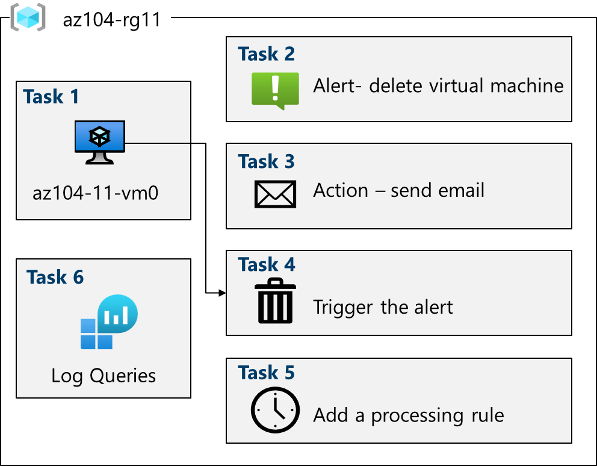

---
lab:
  title: 'ラボ 11: 監視を実装する'
  module: Administer Monitoring
---

# ラボ 11 - 監視を実装する

## ラボ概要

このラボでは、Azure Monitor について学習します。 アラートを作成してアクション グループに送信する方法について学習します。 アラートをトリガーしてテストし、アクティビティ ログを調べます。  

このラボでは Azure サブスクリプションが必要です。 お使いのサブスクリプションの種類により、このラボの機能が使用できるかどうかに影響する可能性があります。 リージョンを変更できますが、手順は**米国東部**を使って作成されています。

## 推定時間:40 分

## ラボのシナリオ

あなたの組織は、インフラストラクチャを Azure に移行しました。 管理者は、インフラストラクチャの大幅な変更の通知を受け取る必要があります。 あなたは、Log Analytics などの Azure Monitor の機能を調べることを計画しています。

## 対話型のラボ シミュレーション

このトピックに役立つ可能性のある対話型ラボ シミュレーションがあります。 このシミュレーションを使用すると、同様のシナリオを自分のペースでクリックしながら進めることができます。 対話型シミュレーションとこのラボには違いがありますが、主要な概念の多くは同じです。 Azure サブスクリプションは必要ありません。

+ [監視を実装します。](https://mslabs.cloudguides.com/guides/AZ-104%20Exam%20Guide%20-%20Microsoft%20Azure%20Administrator%20Exercise%2017) Log Analytics ワークスペースと Azure Automation ソリューションを作成します。 仮想マシンの監視と診断の設定を確認します。 Azure Monitor と Log Analytics の機能を確認します。 

## アーキテクチャの図



## 職務スキル

+ タスク 1:テンプレートを使用してインフラストラクチャをプロビジョニングします。
+ タスク 2:アラートを作成します。
+ タスク 3:アクション グループの通知を構成します。
+ タスク 4:アラートをトリガーし、動作していることを確認します。
+ タスク 5:警告処理ルールを構成します。
+ タスク 6:Azure Monitor のログ クエリを使用します。

## タスク 1:テンプレートを使用してインフラストラクチャをプロビジョニングする

このタスクでは、監視シナリオのテストに使用する仮想マシンをデプロイします。

1. **\\Allfiles\\Lab11\\az104-11-vm-template.json** ラボ ファイルをコンピューターにダウンロードします。

1. **Azure portal** - `https://portal.azure.com` にサインインします。

1. Azure portal から、`Deploy a custom template` を検索して選択します。

1. [カスタム デプロイ] ページで、**[エディターで独自のテンプレートを作成する]** を選択します。

1. [テンプレートの編集] ページで、**[ファイルの読み込み]** を選択します。

1. **\\Allfiles\\Labs11\\az104-11-vm-template.json** ファイルを見つけて選び、**[開く]** を選びます。

1. **[保存]** を選択します。

1. 次の情報を使用してカスタム デプロイ フィールドを完了します。他のすべてのフィールドは既定値のままにします。

    | 設定       | 値         | 
    | ---           | ---           |
    | サブスクリプション  | お使いの Azure サブスクリプション |
    | Resource group| `az104-rg11` (必要に応じて、**[新規作成]** を選択します)
    | リージョン        | **米国東部**   |
    | Username (ユーザー名)      | `localadmin`   |
    | Password (パスワード)      | 複雑なパスワードを指定します |
    
1. **[確認および作成]** を選択し、次に **[作成]** を選択します。

1. デプロイが完了するまで待ってから、**[リソース グループに移動]** をクリックします。

1. デプロイされたリソースを確認します。 1 つの仮想ネットワークと 1 つの仮想マシンがあるはずです。

**仮想マシン用に Azure Monitor を構成する (これは最後のタスクで使われます)**

1. ポータルで、「**Monitor**」を検索して選びます。

1. 少し時間を取り、分析情報、検出、トリアージ、診断に関して利用できるすべてのツールを確認してください。

1. **[VM の分析情報]** ボックスで **[表示]** を選んでから、**[分析情報の構成]** を選びます。

1. お使いの仮想マシンを選び、**[有効にする]** を選びます (2 回)。

1. サブスクリプションとデータ収集ルールは既定値をそのまま使って、**[構成]** を選びます。 

1. 仮想マシン エージェントのインストールと構成には数分かかります。その後、次のステップに進みます。 
   
## タスク 2:アラートを作成する

このタスクでは、仮想マシンが削除されたときのアラートを作成します。 

1. 引き続き **[モニター]** ページで、**[アラート]** を選びます。 

1. **[作成 +]** を選んで、**[警告ルール]** を選びます。 

1. リソース グループのボックスをオンにしてから、**[適用]** を選びます。 このアラートは、リソース グループ内のすべての仮想マシンに適用されます。 または、特定のマシンを 1 つだけ指定することもできます。 

1. **[条件]** タブを選んでから、**[すべてのシグナルを表示]** リンクを選びます。

1. **[仮想マシンの削除 (Virtual Machines)]** を見つけて選びます。 その他の組み込みシグナルに注意してください。 **[適用]** を選択します

1. **[アラート ロジック]** 領域 (下にスクロール) で、**[イベント レベル]** の選択を確認します。 既定値の **[すべて選択済み]** のままにします。

1. **[状態]** の選択を確認します。 既定値の **[すべて選択済み]** のままにします。

1. 次のタスクのため、**[アラート ルールの作成]** ペインを開いたままにします。

## タスク 3:アクション グループの通知を構成する

このタスクでは、アラートがトリガーされた場合、運用チームにメール通知を送信します。 

1. アラートに関する作業を続けます。 **[次へ: アクション]** を選んでから、**[アクション グループの作成]** を選びます。

    >**ご存知でしたか?** 警告ルールには、最大 5 つのアクション グループを追加できます。 アクション グループは、特定の順序はなく、同時に実行されます。 複数の警告ルールで同じアクション グループを使用できます。 

1. **[基本]** タブで、各設定に対して次の値を入力します。

    | 設定 | 値 |
    |---------|---------|
    | **プロジェクトの詳細** |
    | サブスクリプション | 該当するサブスクリプション |
    | リソース グループ | **az104-rg11** |
    | リージョン | **グローバル** (既定) |
    | **インスタンスの詳細** |
    | アクション グループ名 | `Alert the operations team` (リソース グループ内で一意である必要があります) |
    | [表示名] | `AlertOpsTeam` |

1. **[次へ: 通知]** を選び、各設定に次の値を入力します。

    | 設定 | 値 |
    |---------|---------|
    | 通知の種類 | **[Email/SMS message/Push/Voice](メール/SMS メッセージ/プッシュ/音声)** を選択します |
    | 名前 | `VM was deleted` |

1. **[電子メール]** を選択し、**[電子メール]** ボックスにメール アドレスを入力して、**[OK]** を選択します。 

    >**注:**  アクション グループに追加されたことを示すメール通知が届くはずです。 数分間何も起こらないことがあり得ますが、それはルールがデプロイされていることの確実な証拠です。

1. アクション グループが作成されたら、**[次へ: 詳細]** タブに移動し、各設定に次の値を入力します。

    | 設定 | 値 |
    |---------|---------|
    | アラート ルール名 | `VM was deleted` |
    | アラート ルールの説明 | `A VM in your resource group was deleted` |

1. **[確認と作成]** を選択して入力を検証してから、**[作成]** を選択してください。

## タスク 4:アラートをトリガーし、動作していることを確認する

このタスクでは、アラートをトリガーして、通知が送信されることを確認します。 

>**注:**  警告ルールがデプロイされる前に仮想マシンを削除すると、警告ルールがトリガーされないことがあります。 

1. ポータルで、**[仮想マシン]** を検索して選択します。

1. **az104-vm0** 仮想マシンのチェック ボックスをオンにします。

1. メニュー バーで **[削除]** を選択します。

1. **[強制削除の適用]** チェック ボックスをオンにします。 確認のために「`delete`」と入力した後、**[削除]** を選びます。 

1. タイトル バーで **[通知]** アイコンを選んで、**vm0** が正常に削除されるまで待ちます。

1. 次のような通知メールを受け取る必要があります: "**重要な注意: Azure Monitor alert VM was deleted was activated...**" (VM が削除されたことを示す Azure Monitor アラートがアクティブになりました...)そうでない場合は、メール プログラムを開き、azure-noreply@microsoft.com からのメールを探します。

    
   
1. Azure portal のリソース メニューで **[監視]** を選択してから、左側のメニューで **[アラート]** を選択します。

1. **vm0** の削除により、3 つの詳細アラートが生成される必要があります。

   >**注:**  アラート メールが送信され、ポータルでアラートが更新されるまで、数分かかる場合があります。 待ちたくない場合は、次のタスクに進んでから、戻ってください。 

1. いずれかのアラートの名前を選択します (例: **[VM was deleted] (VM が削除されました)**)。 イベントの詳細を示す **[アラートの詳細]** ペインが表示されます。

## タスク 5:警告処理ルールを構成する

このタスクでは、メインテナント期間中に通知を抑制する警告ルールを作成します。 

1. 引き続き **[アラート]** ブレードで、**[アラート処理ルール]** を選んでから **[+ 作成]** を選びます。 
   
1. 自分の**リソース グループ**を選んで、**[適用]** を選びます。
   
1. **[次へ: ルール設定]** を選択し、**[通知の抑制]** を選択します。
   
1. **[次へ: スケジュール設定]** を選択してください。
   
1. 既定では、ルールは、ユーザーが無効にしたりスケジュールを構成したりしない限り、常に機能しています。 夜間のメインテナント中に通知を抑制するルールを定義します。
警告処理ルールのスケジュール設定に、次の設定を入力してください。

    | 設定 | 値 |
    |---------|---------|
    | ルールを適用するタイミング | 特定時刻 |
    | 先頭 | 今日の日付の午後 10 時を入力します。 |
    | 末尾 | 明日の日付の午前 7 時を入力します。 |
    | タイム ゾーン | ローカル タイムゾーンを選択してください。 |

    

1. **[次へ: 詳細]** を選択し、次の設定を入力します。

    | 設定 | 値 |
    |---------|---------|
    | リソース グループ | **az104-rg11** |
    | 規則名 | `Planned Maintenance` |
    | 説明 | `Suppress notifications during planned maintenance.` |

1. **[確認と作成]** を選択して入力を検証してから、**[作成]** を選択してください。

## タスク 6:Azure Monitor のログ クエリを使用する

このタスクでは、Azure Monitor を使って、仮想マシンからキャプチャされたデータのクエリを実行します。

1. Azure portal で `Monitor` ブレードを見つけて選び、**[ログ]** をクリックします。

1. 必要な場合はスプラッシュ画面を閉じます。 

1. スコープとして自分の**リソース グループ**を選びます。 **適用**を選択します。 

1. **[クエリ]** タブで、**[仮想マシン]** (左側のペイン) を選びます。 

1. 使用できるメトリックを確認します。 **[Count heartbeats] (ハートビート数)** クエリを **[実行]** (クエリをポイント) します。

1. 仮想マシンが実行していたときのハートビート数を受け取る必要があります。

1. クエリを確認します。 このクエリでは、*heartbeat* テーブルが使われています。 

1. クエリを次のように置き換えて、**[実行]** をクリックします。 結果のグラフを確認します。 

   ```
    InsightsMetrics
    | where TimeGenerated > ago(1h)
    | where Name == "UtilizationPercentage"
    | summarize avg(Val) by bin(TimeGenerated, 5m), Computer //split up by computer
    | render timechart
   ```

1. 時間があれば、他のクエリを確認して実行してみてください。 

    >**ご存知でしたか?**: 他のクエリを試したい場合は、[Log Analytics デモ環境](https://learn.microsoft.com/azure/azure-monitor/logs/log-analytics-tutorial#open-log-analytics)があります。
    
    >**ご存知でしたか?**: 好みのクエリを見つけたら、それからアラートを作成できます。 

## リソースのクリーンアップ

**自分のサブスクリプション**で作業している場合は、お手数ですが、ラボ リソースを削除してください。 これにより、リソースが確実に解放されるため、コストが最小限に抑えられます。 ラボ リソースを削除する最も簡単な方法は、ラボ リソース グループを削除することです。 

+ Azure portal で、リソース グループを選び、**[リソース グループの削除]**、**[リソース グループ名を入力してください]** の順に選び、**[削除]** をクリックします。
+ Azure PowerShell を使用する場合は、「`Remove-AzResourceGroup -Name resourceGroupName`」と入力します。
+ CLI を使用する場合は、「`az group delete --name resourceGroupName`」と入力します。

## 要点

以上でラボは完了です。 このラボの要点は次のとおりです。 

+ アラートは、インフラストラクチャまたはアプリケーションに問題があるかもしれないことにユーザーが気付く前に、問題を検出して対処するのに役立ちます。
+ Azure Monitor データ プラットフォームでは、任意のメトリックまたはログ データ ソースに対してアラートを生成できます。
+ 警告ルールでは、データを監視し、指定されたリソースで何かが起こっていることを示すシグナルをキャプチャします。
+ アラート ルールの条件に一致した場合、アラートがトリガーされます。 複数のアクション (メール、SMS、プッシュ、音声) をトリガーできます。
+ アクション グループには、アラートの通知を受け取る必要がある個人が含まれます。

## 自習トレーニングでさらに学習する

+ [Azure のアラートを使用したインシデント対応の向上](https://learn.microsoft.com/en-us/training/modules/incident-response-with-alerting-on-azure/)。 Azure Monitor のアラート機能を使用して、インフラストラクチャ内のインシデントとアクティビティに対応します。
+ [Azure Monitor を使用して Azure 仮想マシンを監視する](https://learn.microsoft.com/en-us/training/modules/monitor-azure-vm-using-diagnostic-data/)。 Azure Monitor を使って Azure VM を監視し、VM ホストとクライアントのメトリックとログを収集して分析します。
